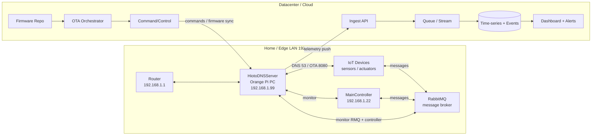
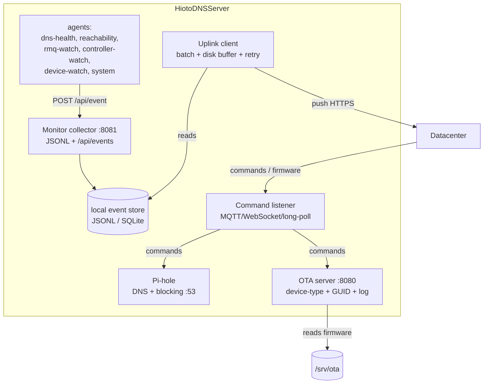
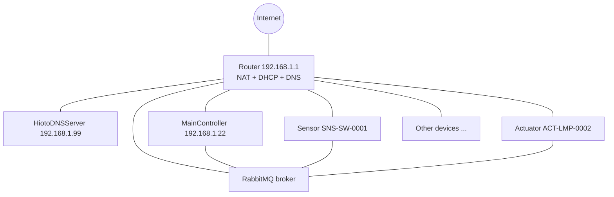
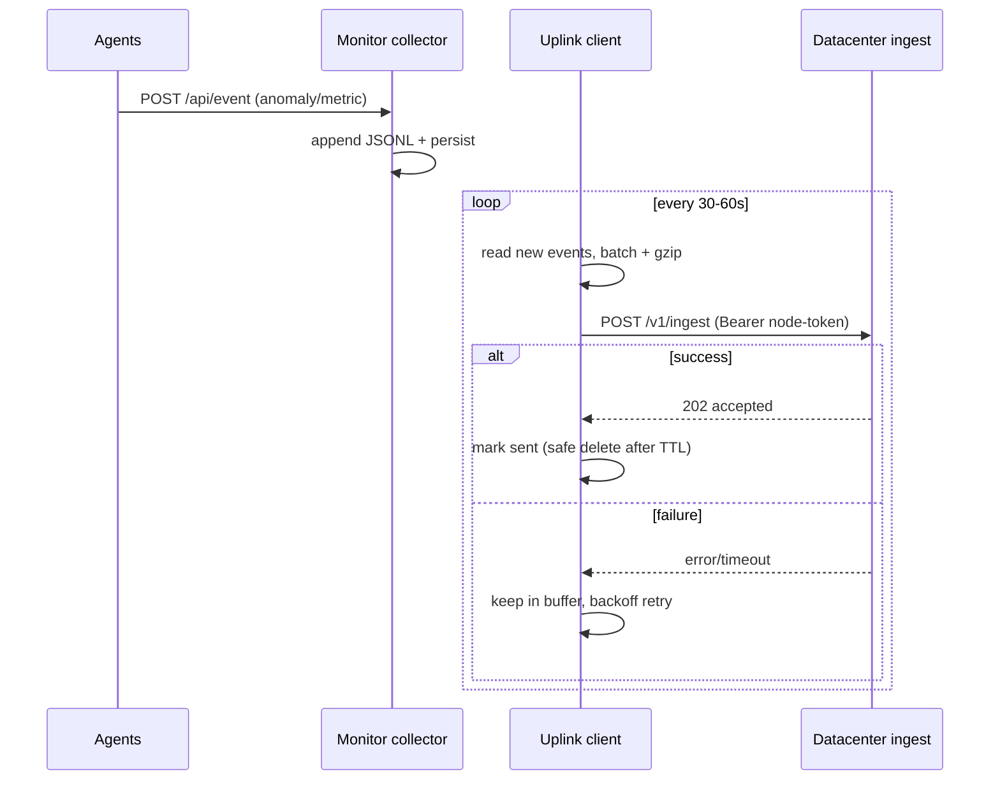
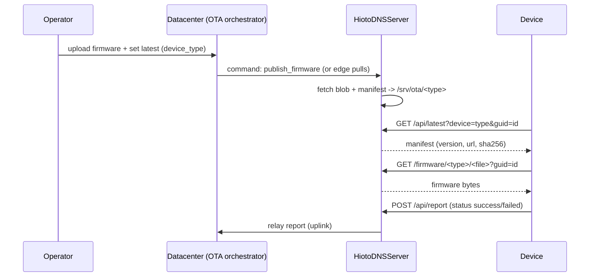
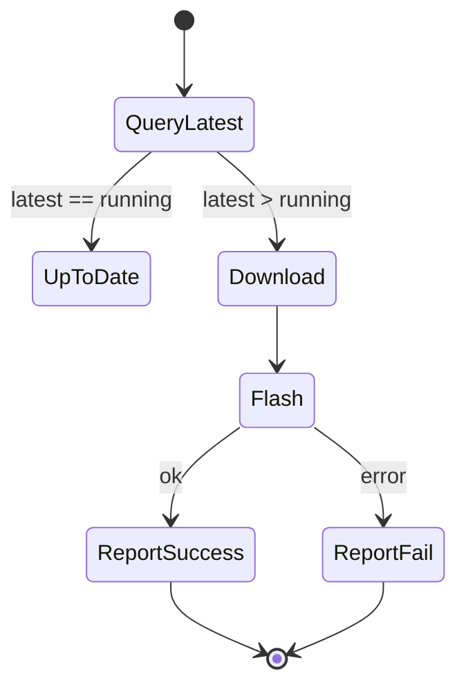
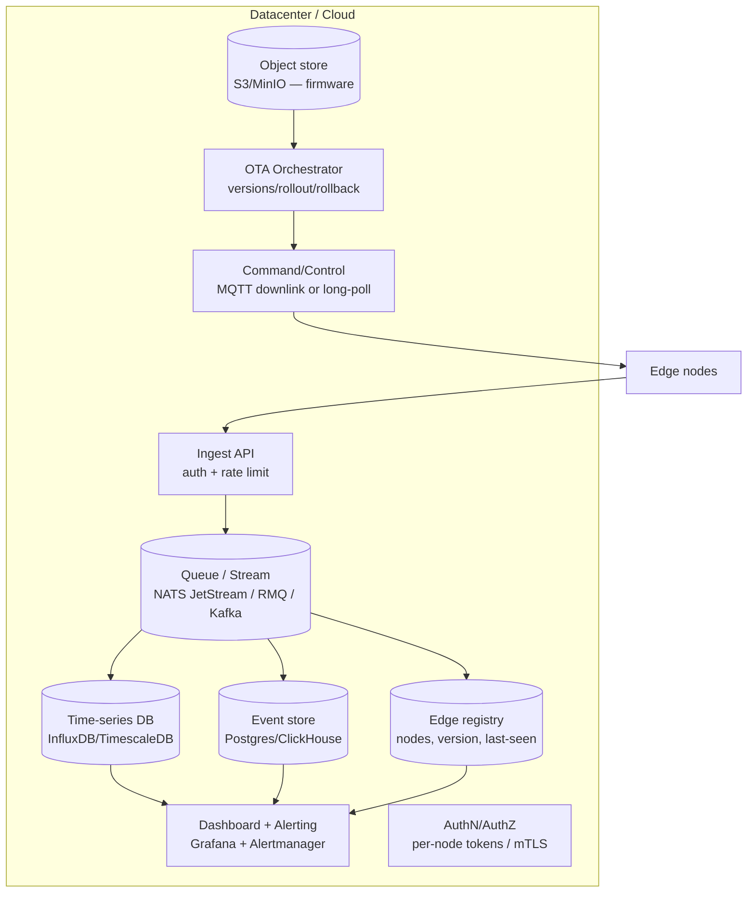

# HIOTO — Edge-to-Datacenter Design Document

| | |
|---|---|
| **Title** | HIOTO Edge (HiotoDNSServer) ↔ Datacenter Architecture |
| **Version** | 1.0 (Draft for review) |
| **Date** | 2026-09-29 |
| **Author** | (auto-generated session) |
| **Status** | Design proposal |

---

## 1. Executive Summary

`HiotoDNSServer` is an **Orange Pi PC** deployed on the home LAN as a combined
**network-DNS / ad-blocking / observability / OTA** edge node. It:

1. Runs **Pi-hole** as the LAN's primary DNS + ad blocker.
2. Hosts a **device-type-aware OTA firmware server** with per-device GUID tracking.
3. Runs lightweight **monitoring agents** that watch DNS, reachability, the home
   automation **controller**, **RabbitMQ (RMQ)**, and system health.
4. **Pushes telemetry up to datacenter applications** over an outbound-only,
   authenticated channel.
5. **Serves firmware down** to local devices, with firmware sourced from the datacenter.

The datacenter is the **source of truth** for firmware and the **analytics/alerting**
plane; the edge is a **resilient, dumb-but-autonomous** node that keeps serving DNS
and OTA even when the datacenter is unreachable.

---

## 2. System Overview



**Figure 2.1** — Logical overview. Everything on the LAN (left) is monitored by
`HiotoDNSServer`, which reports up to the datacenter (right); the datacenter
pushes firmware and commands back down.

> Placeholder image: ``

---

## 3. Naming & Addressing

| Name | Role | Address |
|---|---|---|
| `HiotoDNSServer` | Edge node (this box) | `192.168.1.99` (static) |
| `MainController.hioto` | Home-automation controller | `192.168.1.22` |
| `router` / gateway | LAN gateway + upstream DNS | `192.168.1.1` |
| `RMQ` | RabbitMQ broker (on controller or dedicated) | (TBD) |
| Datacenter apps | central ingest/control | (TBD URL) |

Conventions:
- Edge node id = hostname = `HiotoDNSServer`.
- Devices identify themselves to OTA by `device_type` + `guid`.
- Local DNS: `MainController.hioto → 192.168.1.22` (served by Pi-hole).

---

## 4. Hardware Profile — HiotoDNSServer

| Attribute | Value |
|---|---|
| Board | Orange Pi PC (Allwinner H3) |
| CPU | Quad Cortex-A7, 32-bit ARM |
| RAM | 1 GB |
| OS | Armbian (Debian 13 "trixie", kernel 6.18.52) |
| Storage | microSD |
| Network | 10/100 Ethernet `end0`, static `192.168.1.99/24` |
| Power | 5 V / 2 A (DC barrel or solid GPIO feed) |

**Resource budget (must stay under 1 GB):**

| Workload | Steady RAM |
|---|---|
| OS (Armbian minimal) | ~150–250 MB |
| Pi-hole (FTL + web) | ~150–250 MB |
| OTA server (Python) | ~10–20 MB |
| Monitoring collector | ~10 MB |
| Agents (transient, scheduled) | ~15 MB each, only while running |
| **Total** | **well under 1 GB** |

---

## 5. Edge Node Components (HiotoDNSServer)



**Component responsibilities**

| Component | Description |
|---|---|
| **Pi-hole** | DNS + ad blocking, upstream = router `192.168.1.1`, local DNS `MainController.hioto` |
| **OTA server** | `GET /api/latest`, `GET /firmware/...`, `POST /api/report`, `GET /api/log` |
| **Monitor collector** | receives agent events, appends JSONL, serves `/api/events` |
| **Agents** | scheduled (systemd timers), short-lived, threshold-based anomaly detection |
| **Uplink client** | batches local events, compresses, POSTs over TLS; buffers to disk on failure |
| **Command listener** | receives publish-firmware / config / rollback / reboot from datacenter |
| **Local event store** | durable JSONL/SQLite, survives reboot, is the uplink's source of truth |

---

## 6. Network Topology



- All devices on `192.168.1.0/24` behind the router (NAT).
- `HiotoDNSServer` uses static IP and is the intended **DHCP DNS** target.
- Devices exchange state/commands via **RabbitMQ**; the **controller** consumes sensors
  and publishes actuator commands.
- `HiotoDNSServer` is **out-of-band** of the message bus but observes it via RMQ metrics.

> Placeholder image: ``

---

## 7. Data Flows

### 7.1 Telemetry up (edge → datacenter)



### 7.2 Firmware down (datacenter → edge → device)



### 7.3 OTA lifecycle (edge-local)



---

## 8. Datacenter Architecture



| Layer | Purpose |
|---|---|
| Ingest | accept batched edge reports, validate tokens, rate-limit |
| Queue/stream | decouple ingestion from storage; replay-able |
| Time-series | metrics (latency, qps, queue depth, RAM) |
| Event store | anomaly events + OTA logs |
| Edge registry | which edges exist, versions, last-seen |
| Object store | firmware blobs (source of truth) |
| OTA orchestrator | version channels, rollout, rollback |
| Command/control | push commands to edges |
| Dashboard/alert | visibility + alerting |
| AuthN/AuthZ | per-node identity + operator roles |

---

## 9. API Contracts

### 9.1 Edge-local OTA API (already implemented)

| Method | Endpoint | Purpose |
|---|---|---|
| GET | `/api/devices` | list device types |
| GET | `/api/latest?device=<type>&guid=<id>` | latest manifest |
| GET | `/api/<type>/latest?guid=<id>` | latest manifest (path) |
| GET | `/firmware/<type>/<file>?guid=<id>` | firmware download |
| POST | `/api/report` | post-flash result |
| GET | `/api/log?limit=100` | event log |

### 9.2 Edge-local monitoring API (planned)

| Method | Endpoint | Purpose |
|---|---|---|
| POST | `/api/event` | agent posts an anomaly/metric event |
| GET | `/api/events?agent=&severity=&limit=` | query events |

### 9.3 Datacenter uplink (edge → cloud)

```
POST /v1/ingest
Authorization: Bearer <node-token>
Content-Type: application/json
{
  "node_id": "HiotoDNSServer",
  "sent_at": "2026-09-29T23:30:00Z",
  "events": [ ... ]
}
→ 202 Accepted
```

### 9.4 Datacenter downlink (cloud → edge)

| Method | Endpoint | Purpose |
|---|---|---|
| GET | `/v1/nodes/<id>/commands` (long-poll) | poll for pending commands |
| — or — | MQTT topic `nodes/<id>/cmd` | push commands |

Command shapes:
```json
{"cmd":"publish_firmware","device_type":"esp32","version":"1.2.3"}
{"cmd":"rollback","device_type":"esp32","version":"1.2.2"}
{"cmd":"set_config","key":"...","value":"..."}
{"cmd":"reboot"}
```

### 9.5 Heartbeat

```
POST /v1/heartbeat   { "node_id":"HiotoDNSServer", "ts":..., "stats":{...} }
→ datacenter updates last_seen
```

---

## 10. Event & Log Schema

Unified event (used locally and uplinked):

```json
{
  "time": "2026-09-29T23:30:00Z",
  "ts": 1790724600.0,
  "node_id": "HiotoDNSServer",
  "source": "agent | ota | pihole | system",
  "event_type": "latency_spike | new_device | queue_backlog | ota_execution | ota_report | ...",
  "severity": "info | warn | critical",
  "device_type": "esp32 | controller | null",
  "guid": "device-1111-aaaa",
  "detail": { }
}
```

Event types (union):

| source | event_type | meaning |
|---|---|---|
| agent/dns-health | `ftl_down`, `upstream_timeout`, `query_flood`, `nxdomain_ratio` | DNS health |
| agent/reachability | `packet_loss`, `latency_spike`, `host_unreachable` | link health |
| agent/rmq-watch | `queue_backlog`, `consumer_zero`, `publish_zero`, `node_down` | message bus / device health |
| agent/controller-watch | `controller_down`, `controller_idle` | controller health |
| agent/device-watch | `new_device`, `device_vanished` | device churn |
| agent/system | `mem_high`, `temp_high`, `disk_high` | self-health |
| ota | `query`, `download`, `report` | OTA lifecycle |

---

## 11. Security Model

1. **Edge identity**: one-time-provisioned **node token / mTLS cert** (never reuse the Pi-hole admin password).
2. **Transport**: TLS for all uplink/downlink; gzip payloads.
3. **Outbound-only**: edge dials out; no inbound ports opened on the home router.
4. **Least privilege**: agents run as an unprivileged user; collector and uplink have minimal file access.
5. **Data minimization**: only necessary telemetry is uplinked; PII kept local.
6. **Edge hardening (paused, to revisit)**: disable root SSH, `ufw` allow 22/53/80/443/8080/8081, key-based auth, DNSSEC, unattended-upgrades.
7. **OTA integrity**: firmware is SHA-256 checked on both edge and device; `POST /api/report` can later require an API key.

---

## 12. Deployment & Operations

- **Provisioning** a new edge: flash Armbian → set hostname `HiotoDNSServer` → static IP → install Pi-hole + OTA + agents → provision node token → enroll in datacenter registry.
- **Firmware rollout**: operator uploads to datacenter → orchestrator publishes → edges sync → devices pull.
- **Rollback**: datacenter sends `rollback` command → edge re-points `latest.json` to previous version.
- **Health**: heartbeat every 60 s; dashboard flags edges with stale `last_seen`.
- **Backup**: `/etc/pihole`, `/srv/ota`, `/srv/monitor`, netplan config.

---

## 13. Image / Diagram Placeholders + AI Generation Prompts

Each figure below is a placeholder to be generated with an image model
(Midjourney / DALL·E / Ideogram). Drop the output into `assets/` and keep the
filename. Prompts are written to produce clean, technical, presentation-ready diagrams.

### Fig 2.1 — System Overview
``
> **Prompt:** "Clean flat technical architecture diagram, light background, showing two zones:
> LEFT labeled 'Home / Edge LAN 192.168.1.0/24' containing rounded boxes: 'IoT devices',
> 'MainController 192.168.1.22', 'RabbitMQ', 'HiotoDNSServer (Orange Pi PC) 192.168.1.99',
> 'Router 192.168.1.1'. RIGHT labeled 'Datacenter / Cloud' containing 'Ingest API',
> 'Queue', 'Time-series DB', 'Event store', 'Firmware repo', 'OTA orchestrator',
> 'Dashboard', 'Command/Control'. Solid arrows: devices<->RabbitMQ<->MainController,
> HiotoDNSServer->Ingest (label 'telemetry push'), Command->HiotoDNSServer (label 'firmware/commands').
> Minimalist, 4-color palette (blue/teal/orange/gray), vector style, no photorealism, readable labels."

### Fig 6.1 — Network Topology
``
> **Prompt:** "Network topology diagram, flat vector, light theme. Central 'Router 192.168.1.1'
> with an internet cloud icon above. Branching to 'HiotoDNSServer 192.168.1.99',
> 'MainController 192.168.1.22', 'RabbitMQ', 'Sensor SNS-SW-0001', 'Actuator ACT-LMP-0002',
> 'Other devices...'. Dashed lines show RabbitMQ<->MainController<->devices messaging.
> Highlight HiotoDNSServer with a subtle blue accent. Clean, professional, labeled."

### Fig 5.1 — Edge Node Internals
``
> **Prompt:** "Block diagram of an embedded Linux edge node, flat technical style. A large
> container box labeled 'HiotoDNSServer (Orange Pi PC)'. Inside: 'Pi-hole :53',
> 'OTA server :8080', 'Monitor collector :8081', 'Agents (6 small boxes)',
> 'Uplink client', 'Command listener', 'Local event store (JSONL)'. Arrows show agents->collector,
> collector->store, uplink->(cloud), cloud->command listener. Minimal, labeled, 4-color."

### Fig 7.2 — Firmware Down Flow
``
> **Prompt:** "Horizontal swimlane sequence-style diagram, flat vector. Lanes: 'Operator',
> 'Datacenter', 'HiotoDNSServer', 'Device'. Numbered steps: upload firmware, publish command,
> edge sync, device GET /api/latest, GET /firmware, POST /api/report. Arrows with step numbers,
> clean sans-serif labels, light background."

### Fig 8.1 — Datacenter Stack
``
> **Prompt:** "Cloud infrastructure diagram, flat vector. Stacked layers: 'Ingest API',
> 'Queue/Stream', 'Time-series DB', 'Event store', 'Edge registry', 'Object store (firmware)',
> 'OTA orchestrator', 'Command/Control', 'Dashboard + Alerts', 'AuthN/AuthZ'. Edge nodes feed
> Ingest on the left; Command/Control points back down to edges. Clean, labeled, tech palette."

### Fig 7.3 — OTA Lifecycle State Machine
``
> **Prompt:** "State machine diagram, flat vector: states 'QueryLatest', 'UpToDate',
> 'Download', 'Flash', 'ReportSuccess', 'ReportFail' as rounded boxes with arrows and labels
> 'latest==running', 'latest>running', 'ok', 'error'. Light background, minimal color coding."

### Fig 13.1 — Deployment Pipeline
``
> **Prompt:** "Deployment pipeline diagram, flat vector: 'Provision edge' → 'flash Armbian' →
> 'set hostname + static IP' → 'install Pi-hole/OTA/agents' → 'provision node token' →
> 'enroll in datacenter'. Chevron-style flow, numbered, light theme, sans-serif labels."

### Fig 1.1 — Cover / Hero Illustration
``
> **Prompt:** "Modern minimal cover illustration for an edge-computing document titled
> 'HIOTO Edge-to-Datacenter'. A small single-board computer with an antenna and network lines
> connecting upward to a stylized cloud with database icons, and downward to small IoT devices
> (sensor, light bulb). Dark navy-to-teal gradient, clean vector, subtle glow, no text other
> than 'HIOTO'."

---

## Appendix A — Glossary

| Term | Meaning |
|---|---|
| HIOTO | platform name for the home-IoT + DNS + OTA system |
| HiotoDNSServer | the Orange Pi PC edge node (192.168.1.99) |
| MainController | home-automation controller (192.168.1.22) |
| RMQ | RabbitMQ message broker |
| OTA | Over-The-Air firmware update |
| GUID | per-device unique identifier |
| uplink | edge → datacenter telemetry channel |
| downlink | datacenter → edge command/firmware channel |
