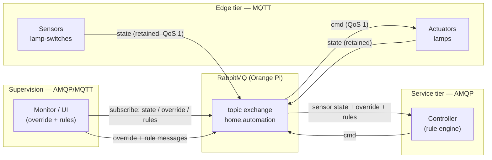
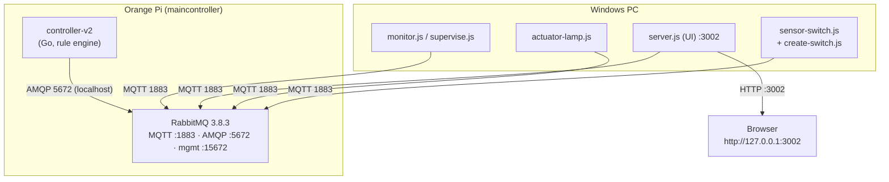
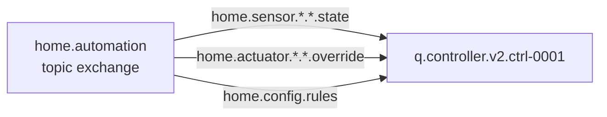
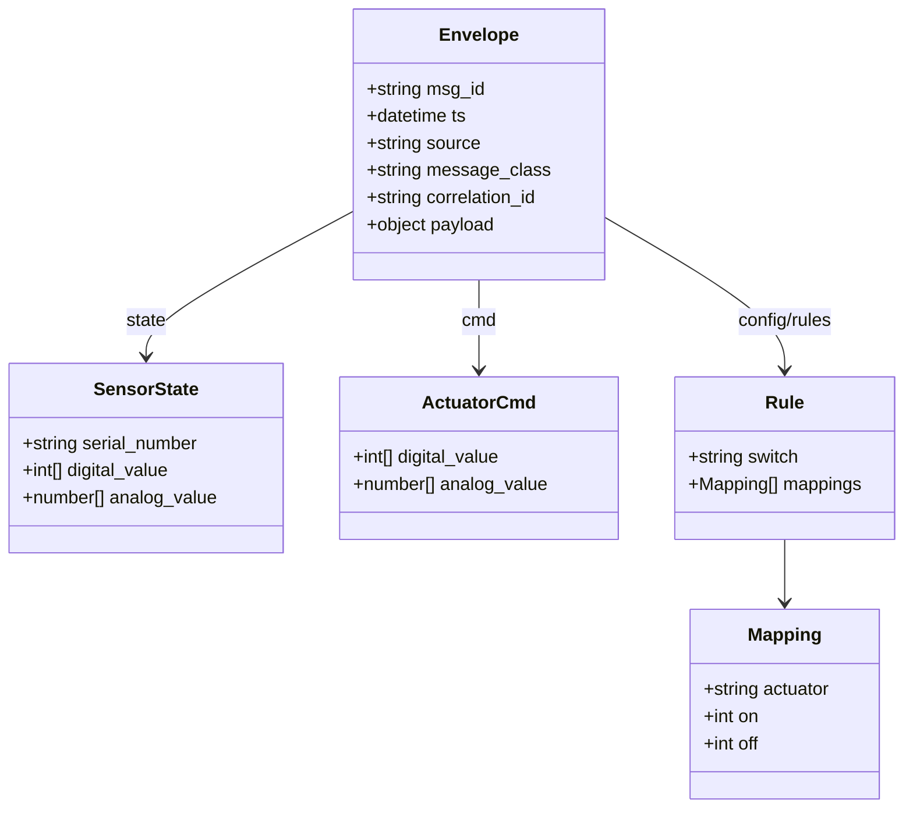
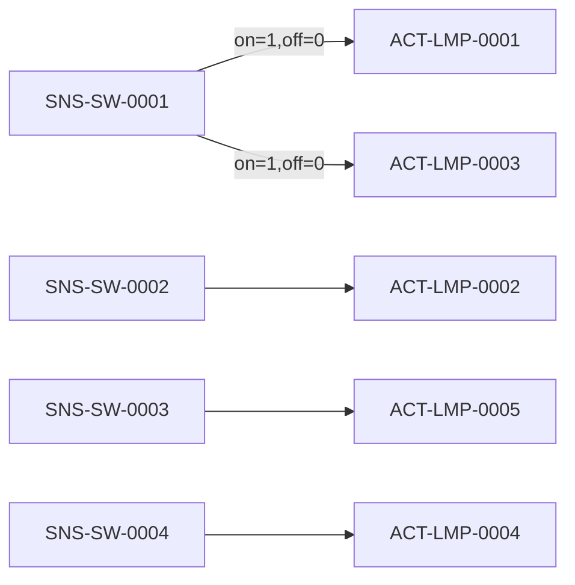
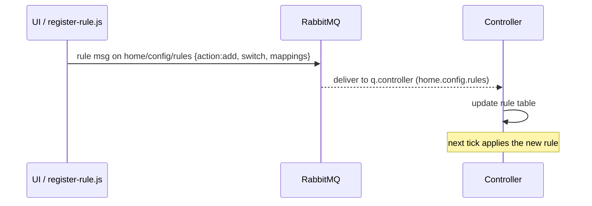
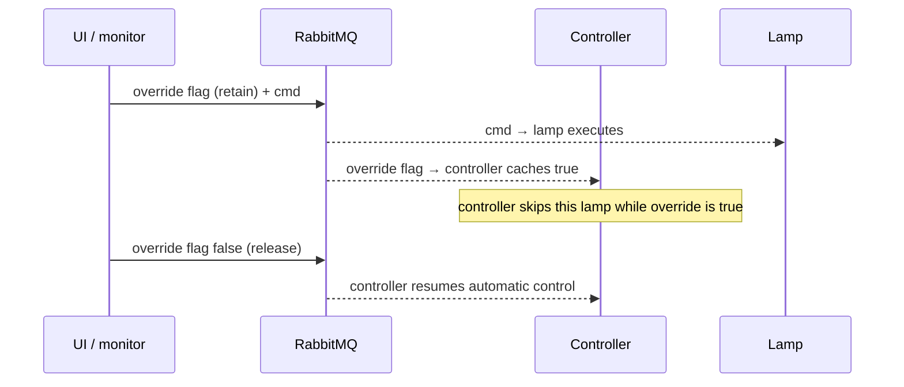

# HomeAutomation v2.0 — Technical Design Document

| | |
|---|---|
| **Document** | HomeAutomation v2.0 — Technical Design |
| **Version** | 2.0 |
| **Status** | Implemented & verified |
| **Date** | 2026-09-16 |
| **Scope** | MQTT/AMQP home automation with a rule-based controller, dynamic device/rule creation, and supervisory override |
| **Related** | `VERSION.md`, `controller-v2/`, `simulator/`, `DESIGN.md` (v1.0 design) |

---

## Table of Contents

1. [Introduction](#1-introduction)
2. [Version History](#2-version-history)
3. [Design Goals & Requirements](#3-design-goals--requirements)
4. [System Overview](#4-system-overview)
5. [Architecture](#5-architecture)
6. [Deployment Topology](#6-deployment-topology)
7. [RabbitMQ Topology](#7-rabbitmq-topology)
8. [Device Model & Data Model](#8-device-model--data-model)
9. [Topic / Routing-Key Convention](#9-topic--routing-key-convention)
10. [Message Envelope & Contracts](#10-message-envelope--contracts)
11. [Rule Engine (v2.0 core)](#11-rule-engine-v20-core)
12. [Control Flow](#12-control-flow)
13. [Dynamic Device Creation](#13-dynamic-device-creation)
14. [Supervisory Control](#14-supervisory-control)
15. [Browser UI](#15-browser-ui)
16. [REST API](#16-rest-api)
17. [Reliability & Fault Handling](#17-reliability--fault-handling)
18. [Security](#18-security)
19. [Deployment & Operations](#19-deployment--operations)
20. [Open Design Decisions & Future Work](#20-open-design-decisions--future-work)
21. [Appendix A — AI Image Generation Prompts](#21-appendix-a--ai-image-generation-prompts)

---

## 1. Introduction

HomeAutomation v2.0 is a home automation system in which **wall-switch sensors**
and **lamp actuators** communicate through a single **RabbitMQ** broker. Edge
devices speak **MQTT**; backend services (a rule-based controller and a
supervisory UI) speak **AMQP**. Both share one **topic exchange**
(`home.automation`), which makes MQTT publishes transparently consumable by AMQP
queues.

v2.0 introduces a **rule engine** so that:

1. a switch can have a **compounding effect** on many lamps
   (e.g. *Switch #1 drives Lamp #1 **and** Lamp #3*), and
2. new switches can be **created at runtime** and their **logic rules
   registered/removed** without restarting the controller.

All payloads are JSON wrapped in a uniform envelope.

---

## 2. Version History

| Version | What changed |
|---|---|
| **1.0** | Fixed **1:1** switch→lamp mapping. Controller `switch-lamp` on the Pi. Monitor + override UI. |
| **2.0** | **Rule engine**: one switch → many lamps (compounding, inversion). **Dynamic** switch creation and rule registration at runtime. |

---

## 3. Design Goals & Requirements

### Functional
- **F1** — A switch can control **multiple** lamps (compounding).
- **F2** — Rules define, per switch, which lamps change and to what value on
  switch ON/OFF (supports inversion).
- **F3** — New switch sensors can be **created at runtime**.
- **F4** — Rules can be **registered/removed at runtime** (no controller restart).
- **F5** — Supervisory **override/release** per lamp, superseding the controller.
- **F6** — Live monitoring of all device states from the browser.

### Non-functional
- **N1** — Edge devices lightweight (MQTT, QoS 1, retained state).
- **N2** — Backend reliable (AMQP durable queues, persistent messages, acks).
- **N3** — At-least-once delivery for commands.
- **N4** — Single broker mediates both protocols (one exchange).

---

## 4. System Overview



> The single `home.automation` topic exchange is the interoperability point:
> an MQTT publish to topic `home/…/…/…/…` becomes an AMQP message with routing
> key `home.….….….…` on the same exchange.

---

## 5. Architecture

### 5.1 Protocol tiers

| Tier | Protocol | Components | Rationale |
|---|---|---|---|
| Edge | **MQTT** | sensors, actuators | low overhead, persistent sessions, retained state |
| Service | **AMQP 0-9-1** | controller, monitor/UI | durable queues, acks, rich routing-key bindings |

### 5.2 Components

| Component | Lang | Where | Role |
|---|---|---|---|
| `sensor-switch.js` | Node.js | PC | 5 (extensible) switch sensors, publish retained state |
| `create-switch.js` | Node.js | PC | spawn a single new switch at runtime |
| `actuator-lamp.js` | Node.js | PC | 5 lamp actuators, consume `cmd`, publish `state` |
| `controller-v2` | Go | **Orange Pi** | rule engine: read sensor states, apply rules, emit `cmd` |
| `server.js` + `public/` | Node.js | PC | browser UI + supervision (override/release, rules, switch creation) |
| `monitor.js` / `supervise.js` | Node.js | PC | CLI monitor + scriptable supervision |

---

## 6. Deployment Topology




> **📷 Image placeholder** — generate with prompt **A1** in
> [Appendix A](#21-appendix-a--ai-image-generation-prompts).

---

## 7. RabbitMQ Topology

- **Exchange**: `home.automation` (topic, durable) — shared by MQTT plugin and AMQP.
- **MQTT plugin**: `mqtt.exchange = home.automation`.
- **Controller queue** (`q.controller.v2.ctrl-0001`, durable), bindings:

| Binding | Purpose |
|---|---|
| `home.sensor.*.*.state` | all sensor state |
| `home.actuator.*.*.override` | supervisory override flags |
| `home.config.rules` | runtime rule registration |




> **📷 Image placeholder** — prompt **A2**.

---

## 8. Device Model & Data Model

### 8.1 Common base state

```json
{
  "serial_number": "SNS-SW-0001",
  "alias_name": "Living Room Switch A",
  "mac_address": "AA:BB:CC:00:11:22",
  "device_kind": "sensor | actuator | controller | monitor",
  "device_type": 1,
  "status": "online | offline | fault"
}
```

### 8.2 Sensors & actuators

Both may carry either or both value arrays (positional; index meaning per type):

```json
{ "digital_value": [1, 0, 0] }
```

```json
{ "analog_value": [0.65] }
```

### 8.3 Class model



---

## 9. Topic / Routing-Key Convention

```
home / <device_kind> / <device_type> / <serial_number> / <message_class>
```

| Example | Meaning |
|---|---|
| `home/sensor/1/SNS-SW-0001/state` | switch state (retained) |
| `home/actuator/1/ACT-LMP-0001/state` | lamp state (retained) |
| `home/actuator/1/ACT-LMP-0001/cmd` | lamp command |
| `home/actuator/1/ACT-LMP-0001/override` | manual override flag (retained) |
| `home/config/rules` | rule registration (add/remove) |

MQTT `/` maps to AMQP `.` on the shared exchange.

---

## 10. Message Envelope & Contracts

```json
{
  "msg_id": "uuid",
  "ts": "ISO-8601",
  "source": "serial_number of publisher",
  "message_class": "state | cmd | event",
  "correlation_id": "optional; cmd.msg_id echoed by actuator state",
  "payload": { }
}
```

### 10.1 `state` payload (sensor/actuator)

```json
{ "serial_number": "SNS-SW-0001", "digital_value": [1] }
```

### 10.2 `cmd` payload (actuator target)

```json
{ "digital_value": [1] }
```

### 10.3 rule registration payload (`home/config/rules`)

```json
{
  "action": "add | remove",
  "switch": "SNS-SW-0006",
  "mappings": [
    { "actuator": "ACT-LMP-0001", "on": 1, "off": 0 },
    { "actuator": "ACT-LMP-0003", "on": 1, "off": 0 }
  ]
}
```

---

## 11. Rule Engine (v2.0 core)

### 11.1 Rule model

```
Rule   = switch → Mapping[]
Mapping = { actuator, on, off }
```

- switch `ON`  → each mapped actuator is commanded to its `on` value.
- switch `OFF` → each mapped actuator is commanded to its `off` value.

Supports **compounding** (many actuators per switch) and **inversion**
(`on:0, off:1`).

### 11.2 Default rules (demonstrate compounding)



> Switch #1 has a **compounding** effect on Lamp #1 **and** Lamp #3.
> `SNS-SW-0005` has no default rule — register one at runtime.

### 11.3 Evaluation loop (pseudocode)

```
every period_ms:
  for each rule in rules:
    sw = cached_state[rule.switch].digital_value[0]   # 0 if unknown
    for each mapping in rule.mappings:
      if override[mapping.actuator]: continue          # supervisory wins
      target = (sw == 1) ? mapping.on : mapping.off
      publish cmd(home/actuator/1/<actuator>/cmd, {digital_value:[target]})
```

- **Event-driven ingestion**: sensor/override/rule messages are cached and acked
  immediately; the timer only gates *evaluation*.
- **At-least-once** for `cmd`: AMQP persistent + publisher confirms, MQTT QoS 1.

### 11.4 Conflict note

Multiple switches may target the same lamp. Within one cycle the **last-processed
rule wins** (Go map iteration order). For deterministic behavior, keep rules
non-overlapping or add a priority field (see §20).

---

## 12. Control Flow

### 12.1 Sensor → Controller → Actuator

```mermaid
sequenceDiagram
    participant S as Switch (MQTT)
    participant B as RabbitMQ
    participant C as Controller (AMQP)
    participant A as Lamp (MQTT)

    S->>B: state home/sensor/1/SNS-SW-0001/state (retain)
    B-->>C: deliver to q.controller (home.sensor.*.*.state)
    Note over C: cache value; ack
    loop every period_ms
        C->>C: evaluate rules (switch → lamps)
        C->>B: cmd home/actuator/1/ACT-LMP-0001/cmd (msg_id=…)
    end
    B-->>A: deliver cmd (MQTT QoS 1)
    A->>A: execute
    A->>B: state home/actuator/1/ACT-LMP-0001/state (retain, correlation_id)
    B-->>C: deliver state → controller confirms
```

### 12.2 Rule registration



### 12.3 Supervisory override / release



---

## 13. Dynamic Device Creation

Creating a new switch:

```mermaid
sequenceDiagram
    participant U as Browser
    participant S as server.js (UI)
    participant P as create-switch.js
    participant B as RabbitMQ

    U->>S: POST /api/switch {serial:"SNS-SW-0006"}
    S->>P: spawn node create-switch.js SNS-SW-0006 (detached)
    P->>B: connect MQTT; publish state (retained, toggling)
    S->>U: {ok:true}
```

The new switch immediately appears in the UI (the server tracks serials seen on
`home/+/+/+/state`), and can then be given a rule (§16).

---

## 14. Supervisory Control

- `override <lamp> on|off` sets a **retained** override flag on
  `home/actuator/1/<lamp>/override` **and** sends the command directly.
- `release <lamp>` clears the flag; the controller resumes automatic control.
- Override **supersedes** the controller (controller skips overridden lamps).

---

## 15. Browser UI

Single-page dashboard at **http://127.0.0.1:3002**:

- **Switches** list (live ON/OFF).
- **Lamps** list (live ON/OFF, `OVERRIDE` badge, Force ON / Force OFF / Release).
- **Rules** list (switch → lamps) with remove.
- **Create switch** (serial input → spawns a new switch).
- **Register a rule** (switch + `ACTUATOR:on:off,…` mappings).

Live updates via **Server-Sent Events**.


> **📷 Image placeholder** — prompt **A3**.

---

## 16. REST API

| Method | Path | Body | Purpose |
|---|---|---|---|
| GET | `/api/state` | — | snapshot: switches, lamps, rules, connected |
| POST | `/api/override` | `{serial, value}` | force lamp on/off (supersede) |
| POST | `/api/release` | `{serial}` | release manual override |
| POST | `/api/switch` | `{serial}` | create (spawn) a new switch |
| POST | `/api/rule` | `{action, switch, mappings}` | register / remove a rule |
| GET | `/events` | — | SSE live stream |

---

## 17. Reliability & Fault Handling

- **Retained `state`** → new subscribers see current values immediately.
- **LWT / `event`** → `status: offline` on ungraceful disconnect.
- **Durable queues + persistent messages** → controller commands survive restart.
- **Acks** on AMQP consume; **QoS 1** on MQTT publish/subscribe.
- **Dead-lettering** (optional `x-dead-letter-exchange`) for poisoned messages.
- **Staleness** — monitors mark a device stale if no state within `stale_after`.

---

## 18. Security

- **Tiered trust**: per-device MQTT users (least privilege) vs. per-service AMQP
  users (stronger secrets). See v1.0 `DESIGN.md` §4.3 for the full model.
- **Topic permissions** restrict publish/subscribe to each device's own topics.
- `mqtt.allow_anonymous = false` recommended in production.

---

## 19. Deployment & Operations

| Component | Run command | Host |
|---|---|---|
| Controller | `/root/controller-v2 -period-ms 1000` | Orange Pi |
| Switches | `node sensor-switch.js` | PC |
| Lamps | `node actuator-lamp.js` | PC |
| UI | `node server.js` → `:3002` | PC |
| New switch | `node create-switch.js <serial>` | PC |
| Rule | `node register-rule.js add <switch> ACT:on:off …` | PC |

Broker config (`rabbitmq.conf`):

```ini
mqtt.exchange = home.automation
```

---

## 20. Open Design Decisions & Future Work

1. **Rule priority** — deterministic order when multiple switches target one lamp.
2. **Create lamp** — symmetric dynamic actuator creation (currently only switches).
3. **Rule persistence** — persist rules to disk/database so they survive controller restart (currently default rules + runtime rules in memory).
4. **Rule DSL** — richer conditions (analog thresholds, schedules, AND/OR).
5. **Auth** — move from shared `admin` to per-device credentials in production.
6. **TLS** — broker and HTTP for non-local deployments.

---

## 21. Appendix A — AI Image Generation Prompts

Use these prompts with an image generator (DALL·E, Midjourney, Stable Diffusion, …)
to produce the placeholder images.

### A1 — Deployment topology

> "Isometric technical illustration of a home automation deployment. Left: a
> Windows laptop labeled only with icons running small Node.js processes
> (sensor switch, lamp actuator, dashboard). Right: a small single-board
> computer (Orange Pi) running a RabbitMQ broker (rabbit icon) and a rule-engine
> controller (brain/gear icon). Connect laptop to Pi with dashed line labeled
> MQTT and solid line labeled AMQP, plus a browser window connected to the laptop
> over HTTP. Flat vector style, dark blue and teal palette, clean, minimal
> labels, 16:9."

### A2 — Broker topology

> "Clean flat diagram of a RabbitMQ message broker: a central topic exchange box
> labeled 'home.automation' with three arrows fanning out to a durable queue box
> labeled 'q.controller.v2'. The three arrows are tagged with routing keys
> 'home.sensor.*.*.state', 'home.actuator.*.*.override', 'home.config.rules'.
> Vector, blueprint style, white background with blue accents, minimal text."

### A3 — Browser UI wireframe

> "Minimal wireframe of a dark-mode home-automation web dashboard: left column
> titled 'Switches' showing five toggle rows, right column titled 'Lamps' showing
> five rows each with ON/OFF buttons and an amber OVERRIDE badge, plus a 'Rules'
> section listing switch-to-lamp mappings and a 'Register a rule' form. Monospace
> labels, green ON / grey OFF pills, flat dark UI, no photos, 16:10."

### A4 — Home layout (compounding effect)

> "Top-down floor-plan sketch of a living room: five wall switches on one wall
> and five floor lamps. Highlight switch #1 with two dashed arrows fanning out to
> lamp #1 and lamp #3 to show the compounding control effect. Blueprint/floor-plan
> style, white background, thin blue lines and small labels, clean and legible."

---

*End of document.*
