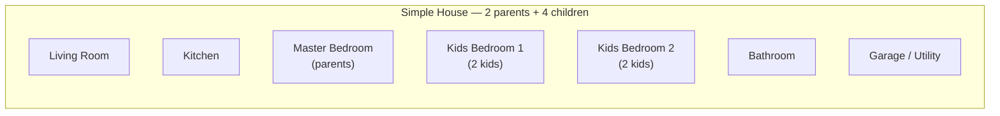
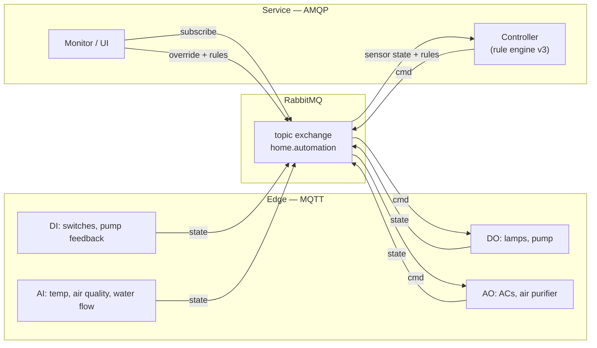
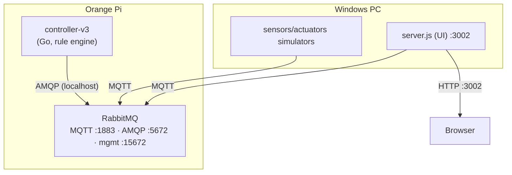
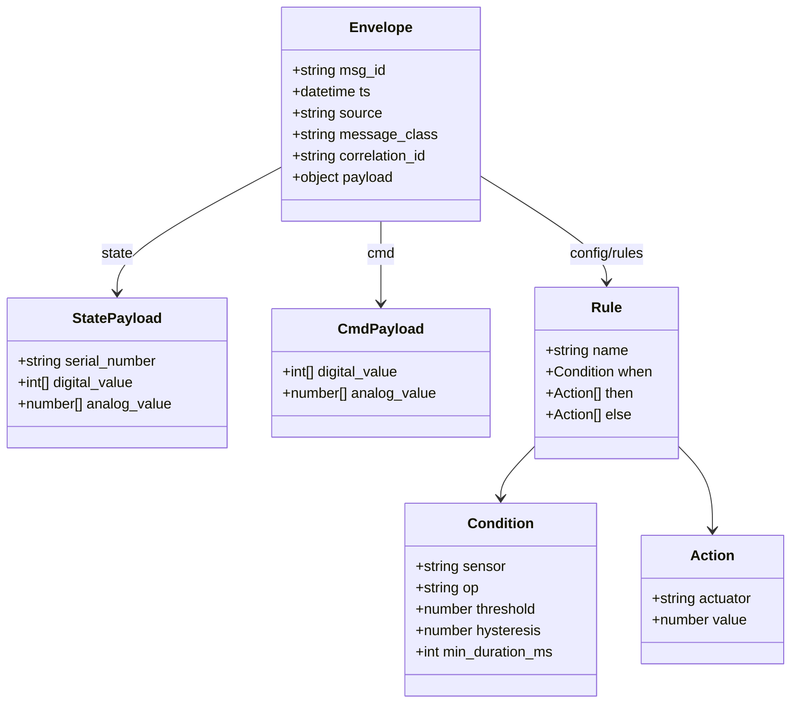
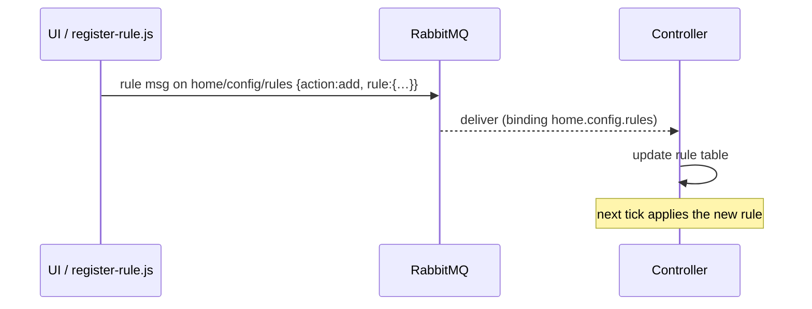

# HomeAutomation v3.0 — Technical Design Document (TDD)

| | |
|---|---|
| **Document** | HomeAutomation v3.0 — Technical Design |
| **Version** | 3.0 |
| **Status** | Design (improves v2.0) |
| **Date** | 2026-09-16 |
| **Predecessor** | v2.0 (`DESIGN-v2.md`) — rule engine + dynamic devices |
| **Scenario** | A simple house: 2 parents + 4 children |

---

## Table of Contents

1. [Introduction](#1-introduction)
2. [Version History](#2-version-history)
3. [Design Goals & Requirements](#3-design-goals--requirements)
4. [The House & Device Inventory](#4-the-house--device-inventory)
5. [System Overview](#5-system-overview)
6. [Architecture](#6-architecture)
7. [Deployment Topology](#7-deployment-topology)
8. [RabbitMQ Topology](#8-rabbitmq-topology)
9. [Device & Data Model](#9-device--data-model)
10. [Topic / Routing-Key Convention](#10-topic--routing-key-convention)
11. [Message Envelope & Contracts](#11-message-envelope--contracts)
12. [Rule Engine v3.0](#12-rule-engine-v30)
13. [House Rules (Reference Set)](#13-house-rules-reference-set)
14. [Control Flows](#14-control-flows)
15. [Supervisory Control](#15-supervisory-control)
16. [Browser UI](#16-browser-ui)
17. [REST API](#17-rest-api)
18. [Reliability & Fault Handling](#18-reliability--fault-handling)
19. [Security](#19-security)
20. [Deployment & Operations](#20-deployment--operations)
21. [Open Design Decisions & Future Work](#21-open-design-decisions--future-work)
22. [Appendix A — AI Image Generation Prompts](#22-appendix-a--ai-image-generation-prompts)

---

## 1. Introduction

HomeAutomation v3.0 generalizes v2.0 from a **switch/lamp** demo into a
**whole-house** automation system for a family of six (2 parents + 4 children).
It adds full **DI/DO** (digital) and **Analog** device classes:

| Class | Devices |
|---|---|
| **DI / DO** (digital) | wall **switches**, **lamps**, water **pump** (+ pump run feedback) |
| **Analog** | **ACs** (cooling output), **air purifier** (fan speed), **water torrent** (flow sensor), plus temperature and air-quality sensors |

The v2.0 rule engine is upgraded with **conditions, thresholds, hysteresis,
debounce, and else-actions** so rules can express real control logic
(e.g. *"if room temperature > 26 °C, run the AC at 80 %; below 24.5 °C, off"*).

All payloads remain JSON in a uniform envelope, mediated by a single RabbitMQ
broker over the shared `home.automation` topic exchange.

---

## 2. Version History

| Version | Scope |
|---|---|
| 1.0 | Fixed 1:1 switch→lamp controller. |
| 2.0 | Rule engine: compounding (switch → many lamps), dynamic switch/rule creation. |
| **3.0** | **Full DI/DO + Analog devices; condition/threshold/hysteresis/debounce rule engine; whole-house scenario.** |

---

## 3. Design Goals & Requirements

### Functional
- **F1** — Support **digital** and **analog** sensors and actuators.
- **F2** — Rules express a **condition** on one sensor and **actions** on many
  actuators (compounding), with optional **else** actions.
- **F3** — Analog thresholds with **hysteresis** (anti-oscillation) and
  **debounce** (`min_duration_ms`).
- **F4** — Runtime creation of devices (switches *and* other types) and runtime
  rule registration/removal.
- **F5** — Supervisory **override/release** per actuator.
- **F6** — Live browser monitoring of the whole house.

### Non-functional
- **N1** — Edge devices lightweight (MQTT, QoS 1, retained state).
- **N2** — Backend reliable (AMQP durable queues, persistent messages, acks).
- **N3** — At-least-once delivery for commands.
- **N4** — Deterministic, auditable control loop (`correlation_id` echo).

---

## 4. The House & Device Inventory

### 4.1 Layout




> **📷 Image placeholder** — prompt **A1**.

### 4.2 Device inventory

**Digital (DI / DO)**

| Serial | Kind | Type | Room | Notes |
|---|---|---|---|---|
| `SNS-SW-001` | sensor | 1 | Living | wall switch |
| `SNS-SW-002` | sensor | 1 | Kitchen | wall switch |
| `SNS-SW-003` | sensor | 1 | Master | wall switch |
| `SNS-SW-004` | sensor | 1 | Kids 1 | wall switch |
| `SNS-SW-005` | sensor | 1 | Kids 2 | wall switch |
| `SNS-SW-006` | sensor | 1 | Bathroom | wall switch |
| `SNS-SW-007` | sensor | 1 | Garage | master switch |
| `ACT-LMP-001…007` | actuator | 1 | (per room) | lamps |
| `ACT-PMP-001` | actuator | 1 | Garage | water pump |
| `SNS-PMP-001` | sensor | 1 | Garage | pump run feedback |

**Analog**

| Serial | Kind | Type | Room | Signal / unit |
|---|---|---|---|---|
| `SNS-TMP-001…004` | sensor | 2 | Living/Master/Kids1/Kids2 | temperature (°C) |
| `SNS-AIR-001` | sensor | 2 | Living | air quality (AQI) |
| `SNS-FLW-001` | sensor | 2 | Garage | **water torrent** — flow (L/min) |
| `ACT-AC-001…004` | actuator | 2 | Living/Master/Kids1/Kids2 | AC cooling output (0…1) |
| `ACT-APR-001` | actuator | 2 | Living | purifier fan speed (0…1) |

### 4.3 Type registry (analog semantics)

| device_type | class | `digital_value` | `analog_value` |
|---|---|---|---|
| 1 | DI/DO | channel(s) 0/1 | — |
| 2 | analog | — | `[value]`, unit per device (see table above) |

---

## 5. System Overview



---

## 6. Architecture

| Tier | Protocol | Components |
|---|---|---|
| Edge | MQTT | switches, lamps, pump, ACs, purifier, temp/air/flow sensors |
| Service | AMQP | rule-engine controller (Go, on the Orange Pi), monitor/UI (Node.js) |

Reuses the v2.0 architecture: one durable **topic exchange** `home.automation`,
MQTT plugin mapped to it, AMQP queues bound to routing keys.

---

## 7. Deployment Topology




> **📷 Image placeholder** — prompt **A2**.

---

## 8. RabbitMQ Topology

- Exchange: `home.automation` (topic, durable).
- Controller queue: `q.controller.v3.ctrl-0001` (durable), bindings:

| Binding | Purpose |
|---|---|
| `home.sensor.*.*.state` | all sensor state (digital + analog) |
| `home.actuator.*.*.override` | override flags |
| `home.config.rules` | runtime rule registration |

---

## 9. Device & Data Model

### 9.1 Base state

```json
{
  "serial_number": "SNS-TMP-001",
  "alias_name": "Living Room Temperature",
  "mac_address": "AA:BB:CC:00:00:11",
  "device_kind": "sensor",
  "device_type": 2,
  "firmware_version": "2.1.0",
  "status": "online"
}
```

### 9.2 Value arrays

| device_type | field | example |
|---|---|---|
| 1 (digital) | `digital_value` | `[1]`, `[1,0,0]` |
| 2 (analog) | `analog_value` | `[26.4]`, `[3.2]`, `[0.75]` |

### 9.3 Class model



---

## 10. Topic / Routing-Key Convention

```
home / <device_kind> / <device_type> / <serial_number> / <message_class>
```

| Example | Meaning |
|---|---|
| `home/sensor/1/SNS-SW-001/state` | digital switch state |
| `home/sensor/2/SNS-TMP-001/state` | analog temperature state |
| `home/actuator/1/ACT-PMP-001/cmd` | pump command (digital) |
| `home/actuator/2/ACT-AC-001/cmd` | AC command (analog) |
| `home/actuator/1/ACT-PMP-001/override` | pump override flag |
| `home/config/rules` | rule registration |

`device_type` = `1` (digital) or `2` (analog). MQTT `/` ⇄ AMQP `.` on the shared
exchange.

---

## 11. Message Envelope & Contracts

```json
{
  "msg_id": "uuid",
  "ts": "ISO-8601",
  "source": "serial_number of publisher",
  "message_class": "state | cmd | event",
  "correlation_id": "optional; cmd.msg_id echoed by actuator state",
  "payload": { }
}
```

### 11.1 `state`

```json
{ "serial_number": "SNS-TMP-001", "analog_value": [26.4] }
```

### 11.2 `cmd`

```json
{ "analog_value": [0.8] }
```

```json
{ "digital_value": [1] }
```

### 11.3 Rule registration (`home/config/rules`)

```json
{
  "action": "add",
  "rule": {
    "name": "living AC",
    "when": { "sensor": "SNS-TMP-001", "op": ">", "threshold": 26.0, "hysteresis": 1.5 },
    "then": [ { "actuator": "ACT-AC-001", "value": 0.8 } ],
    "else": [ { "actuator": "ACT-AC-001", "value": 0.1 } ]
  }
}
```

---

## 12. Rule Engine v3.0

### 12.1 Rule model

```
Rule    = { name, when, then[], else[] }
when    = { sensor, op, threshold, hysteresis?, min_duration_ms? }
action  = { actuator, value }           # digital 0/1, or analog float
```

- `op` ∈ `==`, `!=`, `>`, `<`, `>=`, `<=`.
- `then` = actions when the condition evaluates **true**.
- `else` = actions when **false** (optional; if absent, nothing is sent when false).
- Multiple actions ⇒ **compounding** (one rule drives many actuators).

### 12.2 Hysteresis (anti-oscillation)

Two effective thresholds derived from `threshold` and `hysteresis`:

- transition to **true**  when `value > threshold`  (for `>`; analogously for other ops)
- transition to **false** when `value < threshold − hysteresis`

This prevents rapid cycling (e.g. AC flapping around 26 °C).

### 12.3 Debounce (`min_duration_ms`)

The raw condition must hold continuously for `min_duration_ms` before the rule
output flips. Useful for noisy signals (water flow).

### 12.4 Evaluation loop (pseudocode)

```
every period_ms:
  for each rule in rules:
    v = cached_state[rule.when.sensor]      # digital_value[0] or analog_value[0]
    raw = compare(v, rule.when.op, rule.when.threshold)
    out = hysteresis/debounce(raw, rule)    # per-rule state machine
    if out: publish(rule.then)   else: publish(rule.else)
```

Per-rule state tracks the current output and the time the raw condition last
changed, to implement hysteresis and debounce.

- **Event-driven ingestion**: sensor/override/rule messages are cached and acked
  immediately; the timer only gates *evaluation*.
- **At-least-once** commands: AMQP persistent + confirms, MQTT QoS 1.

### 12.5 Conflict note

As in v2.0, multiple rules may target the same actuator; the last-processed rule
wins. v3.0 reserves a future **priority** field (see §21).


> **📷 Image placeholder** — prompt **A3**.

---

## 13. House Rules (Reference Set)

### R1 — switch → lamp (per room, digital)

```json
{ "name":"living light", "when":{"sensor":"SNS-SW-001","op":"==","threshold":1},
  "then":[{"actuator":"ACT-LMP-001","value":1}], "else":[{"actuator":"ACT-LMP-001","value":0}] }
```

### R2 — water pump from flow (analog, hysteresis + debounce)

> *"If water torrent flow < 2 L/min for 10 s, run the pump; stop when flow recovers above 3 L/min."*

```json
{ "name":"water pump", "when":{"sensor":"SNS-FLW-001","op":"<","threshold":2.0,"hysteresis":1.0,"min_duration_ms":10000},
  "then":[{"actuator":"ACT-PMP-001","value":1}], "else":[{"actuator":"ACT-PMP-001","value":0}] }
```

### R3 — AC cooling (analog, hysteresis)

```json
{ "name":"living AC", "when":{"sensor":"SNS-TMP-001","op":">","threshold":26.0,"hysteresis":1.5},
  "then":[{"actuator":"ACT-AC-001","value":0.8}], "else":[{"actuator":"ACT-AC-001","value":0.1}] }
```

### R4 — air purifier (analog, hysteresis)

```json
{ "name":"air purifier", "when":{"sensor":"SNS-AIR-001","op":">","threshold":100,"hysteresis":20},
  "then":[{"actuator":"ACT-APR-001","value":1.0}], "else":[{"actuator":"ACT-APR-001","value":0.3}] }
```

### R5 — master off (compounding across many actuators)

```json
{ "name":"all off", "when":{"sensor":"SNS-SW-007","op":"==","threshold":1},
  "then":[
    {"actuator":"ACT-LMP-001","value":0}, {"actuator":"ACT-LMP-002","value":0},
    {"actuator":"ACT-LMP-003","value":0}, {"actuator":"ACT-LMP-004","value":0},
    {"actuator":"ACT-LMP-005","value":0}, {"actuator":"ACT-LMP-006","value":0},
    {"actuator":"ACT-PMP-001","value":0}
  ] }
```

---

## 14. Control Flows

### 14.1 Analog sense → process → actuate (AC)

```mermaid
sequenceDiagram
    participant T as Temp sensor (MQTT)
    participant B as RabbitMQ
    participant C as Controller (AMQP)
    participant A as AC (MQTT)

    T->>B: state home/sensor/2/SNS-TMP-001/state {analog_value:[27.0]}
    B-->>C: deliver to q.controller
    Note over C: cache; ack
    loop every period_ms
        C->>C: eval R3: 27.0 > 26.0 (true) → hysteresis state ON
        C->>B: cmd home/actuator/2/ACT-AC-001/cmd {analog_value:[0.8]}
    end
    B-->>A: deliver cmd
    A->>A: set cooling 80%
    A->>B: state (retained, correlation_id)
```

### 14.2 Water pump (flow → pump, debounce)

```mermaid
sequenceDiagram
    participant F as Flow sensor (MQTT)
    participant B as RabbitMQ
    participant C as Controller
    participant P as Pump (MQTT)

    F->>B: state {analog_value:[1.5]}  (low flow)
    B-->>C: deliver
    Note over C: R2 raw=true; debounce 10 s
    Note over C: after 10 s of low flow → output ON
    C->>B: cmd home/actuator/1/ACT-PMP-001/cmd {digital_value:[1]}
    B-->>P: deliver cmd → pump ON
```

### 14.3 Rule registration (same as v2.0, extended payload)



---

## 15. Supervisory Control

Same as v2.0, now for any actuator:

- `override <actuator> <value>` — retained override flag on
  `home/actuator/<type>/<serial>/override` + direct command.
- `release <actuator>` — clear flag; controller resumes.
- The controller skips any actuator whose override flag is true.

---

## 16. Browser UI

- **Sensors** (digital + analog) live values.
- **Actuators** (digital + analog) with override/release.
- **Rules** list + register form (condition + then/else actions).
- **House view** (per-room grouping).


> **📷 Image placeholder** — prompt **A4**.

---

## 17. REST API

| Method | Path | Body | Purpose |
|---|---|---|---|
| GET | `/api/state` | — | snapshot: sensors, actuators, rules |
| POST | `/api/override` | `{serial, value}` | override actuator (digital/analog) |
| POST | `/api/release` | `{serial}` | release override |
| POST | `/api/device` | `{serial, kind, type}` | create a new device |
| POST | `/api/rule` | `{action, rule}` | register / remove a rule |
| GET | `/events` | — | SSE live stream |

---

## 18. Reliability & Fault Handling

- Retained `state` for immediate view on subscribe.
- LWT → `status: offline`.
- Durable queue + persistent `cmd` (at-least-once).
- Hysteresis + debounce reduce spurious actuation.
- Optional dead-lettering for poisoned messages.

---

## 19. Security

- Tiered trust: per-device MQTT users vs. per-service AMQP users.
- Topic permissions scoped per device.
- `mqtt.allow_anonymous = false` in production.
- Optional TLS for non-local deployments.

---

## 20. Deployment & Operations

| Component | Command |
|---|---|
| Controller | `/root/controller-v3 -period-ms 1000` (Orange Pi) |
| Simulators | `node sensor-switch.js`, `node actuator-lamp.js`, analog simulators |
| UI | `node server.js` → `:3002` |
| Register rule | `node register-rule.js add <json>` |

Broker config:

```ini
mqtt.exchange = home.automation
```

---

## 21. Open Design Decisions & Future Work

1. **Rule priority** — deterministic ordering when multiple rules target one actuator.
2. **Multi-condition rules** — AND/OR across sensors.
3. **Schedules** — time-of-day conditions.
4. **Rule persistence** — persist rules across controller restart.
5. **PID control** — replace hysteresis with closed-loop control for AC.
6. **Analog unit registry** — formal per-device unit/range metadata.

---

## 22. Appendix A — AI Image Generation Prompts

### A1 — House floor plan

> "Top-down floor-plan blueprint of a modest single-storey family home with
> seven rooms labeled: Living Room, Kitchen, Master Bedroom, Kids Bedroom 1,
> Kids Bedroom 2, Bathroom, Garage. Place small icons for wall switches and
> lamps in each room, an AC unit, an air purifier, a water pump in the garage,
> and a water-flow sensor on a pipe. Clean blueprint style, white background,
> thin blue lines, minimal legible labels, 4:3."

### A2 — Deployment topology

> "Isometric technical illustration of a whole-house automation deployment: a
> laptop (Node.js simulators + dashboard) and a small single-board computer
> (Orange Pi) running RabbitMQ and a rule-engine controller. Dashed lines labeled
> MQTT connect many small device icons (switch, lamp, pump, AC, purifier, water
> flow sensor) to the Pi; a solid line labeled AMQP connects controller to
> broker; a browser connects to the laptop. Flat vector, dark blue/teal palette,
> minimal labels, 16:9."

### A3 — Rule engine

> "Clean conceptual diagram of a rule engine: on the left a sensor icon with a
> gauge (temperature), a central box labeled 'WHEN temp > 26°C (hysteresis
> 1.5°C)' splitting into two arrows: 'THEN → AC 80%' (green) and 'ELSE → AC 10%'
> (grey), both pointing to an AC unit icon. Flat vector, white background with
> blue and green accents, minimal text, 16:9."

### A4 — UI wireframe

> "Dark-mode smart-home dashboard wireframe: left panel 'Sensors' listing
> switches (ON/OFF pills) and analog gauges (temperature °C, AQI, water flow
> L/min); right panel 'Actuators' with lamp/pump toggles, AC and purifier sliders
> with an amber OVERRIDE badge; a 'Rules' section listing condition→action rows
> and a 'Register rule' form. Monospace labels, green/grey pills, flat dark UI,
> no photos, 16:10."

---

*End of document.*
