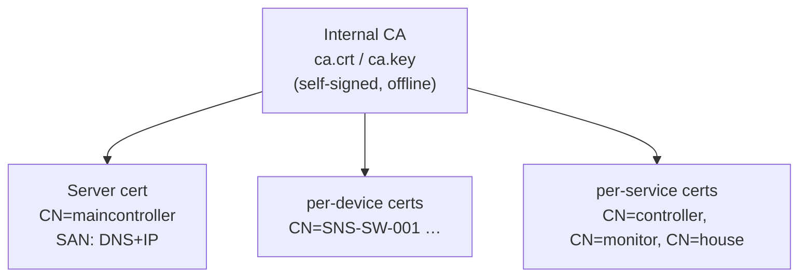
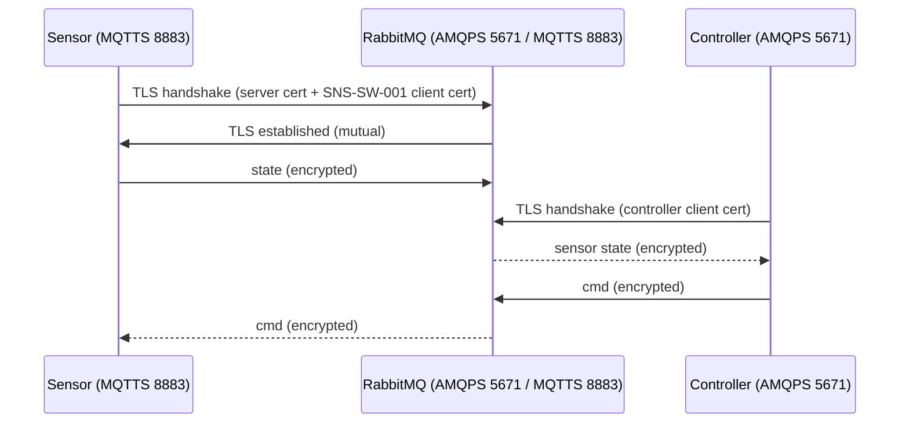

# HomeAutomation v5.0 — Technical Design Document (TDD)

**Mutual TLS (mTLS) with per-device certificates**

| | |
|---|---|
| **Document** | HomeAutomation v5.0 — Technical Design |
| **Version** | 5.0 |
| **Status** | Design (implemented) |
| **Date** | 2026-09-16 |
| **Predecessor** | v4.0 (`DESIGN-v4`) — rule engine + time/trigger |
| **Change** | Add **mutual TLS** with **per-device client certificates** across MQTT, AMQP, and management |

---

## 1. Introduction

v5.0 secures every network hop of the HomeAutomation system with **mutual TLS
(mTLS)**. In mTLS, **both** parties present certificates:

- the **broker** proves its identity to clients with a **server certificate**;
- **each device/service** proves its identity to the broker with its **own
  unique client certificate** (a *per-device certificate*).

This is stronger than one-way TLS (which only authenticates the server) and
stronger than shared credentials (a stolen cert can be revoked per device).

---

## 2. Design Goals & Requirements

- **S1** — Encrypt all traffic: AMQP, MQTT, management UI/API.
- **S2** — **Mutual authentication**: broker requires a valid client cert
  (`verify_peer` + `fail_if_no_peer_cert = true`).
- **S3** — **Per-device identity**: each device/service has a **unique**
  certificate (`CN = serial_number`).
- **S4** — Least-privilege: cert identity maps to the device's existing
  topic-permission scope.
- **S5** — Revocable: a compromised device cert can be revoked independently.
- **S6** — Non-breaking: the rule engine, priorities, triggers, and GUI from
  v4.0 remain unchanged (only the transport/auth layer changes).

### Non-goals
- No HSM/TPM hardware key storage on the 512 MB Orange Pi (documented as future).
- No OCSP/CRL automation in v5.0 (revocation is manual — see §8).

---

## 3. PKI & Certificate Design

A single-tier **internal Certificate Authority (CA)** signs everything:



### 3.1 Certificate inventory

| Cert | CN (identity) | Used by | Protocol |
|---|---|---|---|
| `ca.crt` | HomeAutomation-CA | trust anchor (everyone) | — |
| `server.crt`/`key` | `maincontroller` | RabbitMQ broker | AMQP / MQTT / mgmt |
| `<serial>.crt`/`key` | e.g. `SNS-SW-001` | each edge device | MQTT |
| `controller.crt`/`key` | `controller` | rule-engine controller | AMQP |
| `monitor.crt`/`key` | `monitor` | browser UI server | MQTT |
| `house.crt`/`key` | `house` | device simulator (when one conn is used) | MQTT |

> **Per-device**: each physical/simulated device has its own cert, so
> compromising one device does not let it impersonate another.

### 3.2 Certificate profile

- CA: RSA 2048, self-signed, 10-year validity.
- Server + client: RSA 2048, signed by CA, 1-year validity.
- Server `subjectAltName`: `DNS:maincontroller`, `IP:127.0.0.1`,
  `IP:192.168.137.44` (broker reachability on both loopback and the ICS link).
- Client CN = the device's `serial_number` (globally unique, immutable).

---

## 4. Broker TLS Configuration (RabbitMQ 3.8)

```ini
# AMQP over TLS
listeners.ssl.default        = 5671
# MQTT over TLS
mqtt.listeners.ssl.default   = 8883
# management over HTTPS
management.ssl.port          = 15671
management.ssl.cacertfile    = /etc/rabbitmq/certs/ca.crt
management.ssl.certfile      = /etc/rabbitmq/certs/server.crt
management.ssl.keyfile       = /etc/rabbitmq/certs/server.key

# Mutual TLS (shared by AMQP + MQTT listeners)
ssl_options.cacertfile       = /etc/rabbitmq/certs/ca.crt
ssl_options.certfile         = /etc/rabbitmq/certs/server.crt
ssl_options.keyfile          = /etc/rabbitmq/certs/server.key
ssl_options.verify           = verify_peer          # require + verify client cert
ssl_options.fail_if_no_peer_cert = true            # reject if no client cert
```

- `verify_peer` — the broker validates the client cert chain against `ca.crt`.
- `fail_if_no_peer_cert = true` — connections **without** a client cert are
  **rejected** (this is what makes it *mutual*).

### 4.1 Identity → authorization

The client cert's `CN` is the device identity. RabbitMQ maps it to a user (via
TLS auth mechanism / `ssl_cert_login_from`) whose **topic permissions** scope it
to its own topics — unchanged from v4.0 §Security. Username/password auth is
still available as a second factor if desired.

---

## 5. Client TLS Configuration

### 5.1 Controller (Go, AMQP)

```go
import ("crypto/tls"; "crypto/x509")
ca, _ := os.ReadFile("/etc/rabbitmq/certs/ca.crt")
cert, _ := tls.LoadX509KeyPair("controller.crt", "controller.key")
pool := x509.NewCertPool(); pool.AppendCertsFromPEM(ca)
tlsCfg := &tls.Config{RootCAs: pool, Certificates: []tls.Certificate{cert}, ServerName: "maincontroller"}
conn, err := amqp.DialTLS("amqps://…", tlsCfg)
```

### 5.2 Devices / monitor (Node.js, MQTT)

```js
const fs = require('fs');
mqtt.connect('mqtts://192.168.137.44:8883', {
  ca: fs.readFileSync('ca.crt'),
  cert: fs.readFileSync('SNS-SW-001.crt'),
  key: fs.readFileSync('SNS-SW-001.key'),
  // + username/password if topic-permission auth is retained
});
```

### 5.3 Browser UI

- The Node `server.js` connects to the broker over **MQTTS with the `monitor`
  cert**.
- The browser → `server.js` hop can additionally be HTTPS (self-signed) or a
  reverse proxy — orthogonal to broker mTLS.

---

## 6. Trust & Threat Model

### 6.1 What mTLS protects

| Attack | Before (plaintext) | After (mTLS) |
|---|---|---|
| Eavesdrop MQTT/AMQP traffic | ❌ | ✅ encrypted |
| Rogue broker (MITM) | ❌ | ✅ server cert verified against CA |
| Rogue device impersonating another | ❌ | ✅ requires that device's cert |
| Replay / injection | ❌ | ✅ TLS session integrity |
| Unauthenticated connection | ❌ (anon) | ✅ no-cert connections rejected |

### 6.2 What mTLS does **not** protect

- Compromise of the **CA private key** (then all certs are forgeable — keep CA
  offline; §8).
- Compromise of a **device** (its cert/key can be exfiltrated → rotate it).
- Application-level authz (still enforced by RabbitMQ users/topic permissions).
- The device's own firmware/OS security.

### 6.3 Trust anchor

All parties trust **`ca.crt`**. The CA private key is generated on the Pi and
should be moved offline after signing; server/client keys stay on their hosts.

---

## 7. Control Flow (unchanged, now over TLS)



The rule engine, priorities, and triggers are untouched — only the transport
and client-authentication layer change.

---

## 8. Certificate Lifecycle

### Provisioning (per new device)
```bash
openssl genrsa -out <serial>.key 2048
openssl req -new -key <serial>.key -subj "/CN=<serial>" -out <serial>.csr
openssl x509 -req -in <serial>.csr -CA ca.crt -CAkey ca.key -CAcreateserial \
  -days 365 -out <serial>.crt
```

### Rotation
- Regenerate a device's cert (`<serial>.crt`/`key`) and reload the client.
- Server cert rotation: regenerate `server.crt`, restart RabbitMQ.

### Revocation (manual in v5.0)
- Remove the device's trust by deleting its cert from any allow-list /
  de-provisioning the device user; **CRL/OCSP** is documented as future work
  (RabbitMQ supports CRL via `ssl_options.crlfile`).

---

## 9. Deployment & Operations

| Component | TLS endpoint |
|---|---|
| RabbitMQ | `amqps://maincontroller:5671`, `mqtts://…:8883`, `https://…:15671` |
| Controller | AMQPS 5671 (client cert `controller`) |
| Devices | MQTTS 8883 (per-device cert) |
| UI server | MQTTS 8883 (cert `monitor`) |

Cert directory: `/etc/rabbitmq/certs/` on the Pi; clients keep only their own
`<id>.crt`/`key` + the shared `ca.crt`.

---

## 10. Open Decisions & Future Work

1. **CRL/OCSP** — automated revocation (RabbitMQ `ssl_options.crlfile`).
2. **HSM/TPM** — hardware-protected keys (not on this 512 MB board).
3. **CA offline storage** — move `ca.key` off the broker host.
4. **Short-lived certs** — automate via a CA/step-ca + `cert-manager`-style flow.
5. **TLS auth mechanism** — use cert CN as the sole identity (drop passwords).
6. **Browser HTTPS** — self-signed cert or reverse proxy for the UI.

---

## 11. Appendix A — AI Image Generation Prompts

### A1 — PKI hierarchy
> "Clean flat diagram of a mutual-TLS PKI: a root box labeled 'Internal CA' at
> the top, arrows down to a 'Server cert (maincontroller)' box and several
> 'Per-device certs (SNS-SW-001, ACT-LMP-001, controller, monitor)' boxes. Each
> cert box shows a small key icon. Blueprint style, white background, blue
> accents, minimal labels, 16:9."

### A2 — mTLS handshake
> "Minimal two-sided illustration of a mutual TLS handshake between an IoT
> sensor and a RabbitMQ broker: two arrows crossing showing 'server cert' and
> 'client cert' being exchanged, with a padlock icon between them. Flat vector,
> dark-blue/teal palette, minimal text, 16:9."

---

*End of document.*
