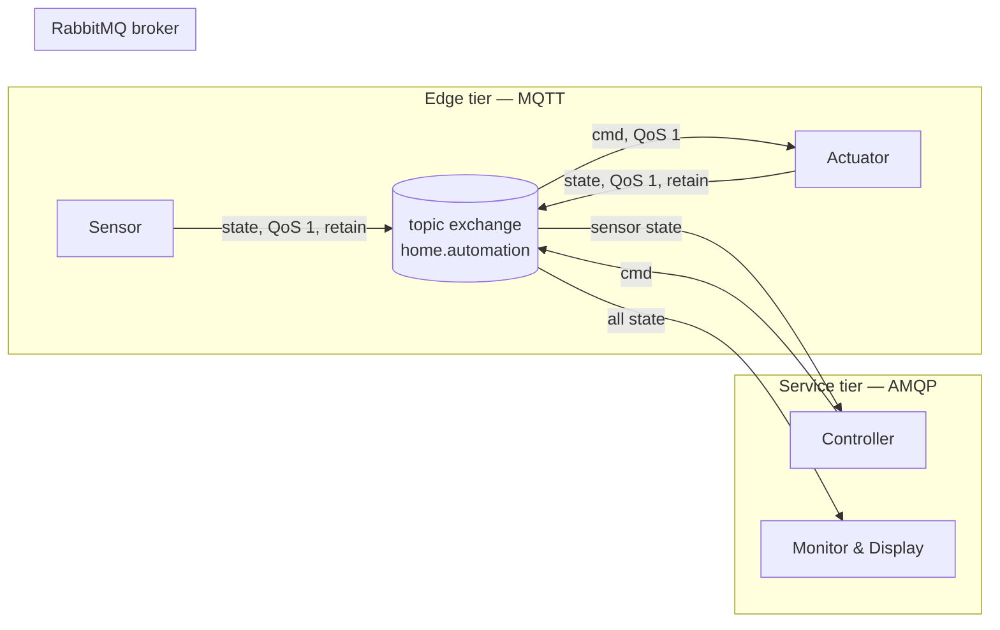
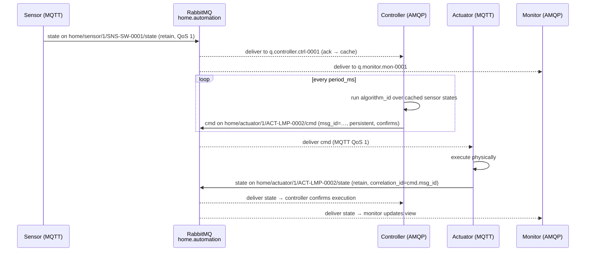
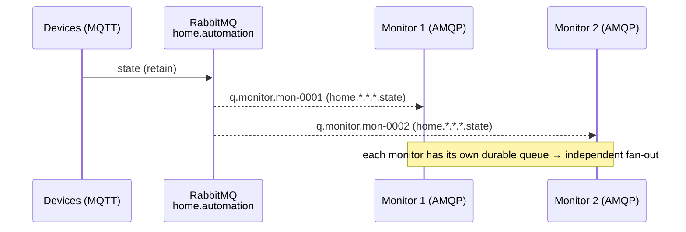

# Home Automation System — Technical Design

MQTT/AMQP home automation with a single RabbitMQ broker as the protocol bridge.
This document is the implementation-ready design: topology, data model, message
contracts, control flow, and the resolutions of all open design decisions.

---

## 1. Scope & Goals

- **Edge tier (MQTT)** — sensors and actuators: resource-constrained, low
  overhead, persistent sessions for offline buffering, QoS 0/1.
- **Service tier (AMQP)** — controller and monitoring/display: durable queues,
  explicit acks, dead-lettering, flexible routing-key bindings, multi-consumer
  fan-out.
- **One broker** — RabbitMQ with the `rabbitmq_mqtt` plugin. MQTT and AMQP share
  the **same topic exchange** (`home.automation`), which is what makes an MQTT
  publish transparently consumable by an AMQP queue.
- **All payloads are JSON** wrapped in a uniform envelope (§6).

---

## 2. Architecture



- Edge ↔ broker: MQTT, mapped by the plugin onto `home.automation`
  (`mqtt.exchange = home.automation`).
- Service ↔ broker: native AMQP 0-9-1 queues bound to `home.automation`.

---

## 3. Resolved Design Decisions

These are the decisions §8 left open, resolved for implementation.

### 3.1 Controller loop: **event-driven ingestion + timer-gated evaluation**

- **Ingestion is event-driven**: the AMQP consumer acks each `state` message
  immediately after writing it to a thread-safe cache (latest-value store keyed
  by `serial_number`). This keeps queue depth ~0 and never blocks the broker.
- **Evaluation is timer-gated**: a fixed ticker at `period_ms` runs the
  algorithm against the cached values. `period_ms` therefore means "control
  loop cadence", not "message polling interval".
- Rationale: decouples bursty sensor traffic from control cadence, prevents a
  slow algorithm from back-pressuring the queue, and keeps ack semantics
  trivial (ack-on-cache, exactly once against the cache).

### 3.2 Retained-message lifecycle for offline devices

- Retain the **last `state`** per topic (MQTT `retain=true`) so new dashboards
  see current values immediately.
- Do **not** expire retained `state` automatically. Instead:
  - LWT publishes an `event` (`offline`) on ungraceful disconnect (§3.3).
  - Monitors/controllers mark a device `stale` if no `state`/`event` has been
    seen within `stale_after` (default 60 s, per-site setting).
  - A housekeeping job (controller-tier) may clear retained topics for devices
    offline longer than `retain_ttl` (default 7 days) using MQTT retained
    clearing or the management API.

### 3.3 LWT payload shape

LWT is an `event`-class message published by the broker (not the device) on
ungraceful disconnect, retained on the device's `event` topic:

```json
{
  "msg_id": "uuid",
  "ts": "2026-09-16T12:00:00Z",
  "source": "SNS-SW-0001",
  "message_class": "event",
  "payload": { "event": "offline", "reason": "lwt" }
}
```

Monitors translate `event:"offline"` → `status:"offline"`. A subsequent normal
`state`/`event:"online"` publish restores `status:"online"`. `fault` is device
reported via `event` with `reason:"fault"`.

### 3.4 Auth / credential tiering — **tiered trust** (diverges from flat creds)

- **MQTT edge**: one user per device (or per kind, per site) with topic-level
  permissions restricted to that device's own topics. Credentials may still be
  provisioned into firmware (acknowledged trade-off), but they are
  least-privilege and revocable per device.
- **AMQP service**: per-service users (`controller.<id>`, `monitor.<id>`) with
  real secrets and scoped read/write permissions. Stronger than edge creds.
- This deliberately diverges from a single hardcoded credential; the broker is
  the enforcement point, so compromise of one edge device does not grant
  broadcast or cross-site access.

### 3.5 Array index semantics — **positional, documented by a type registry**

- `digital_value[i]` / `analog_value[i]` are **positional**; their meaning is
  defined by `device_type` in a small registry (e.g., `device_type:1` digital
  actuator → index 0 = "main relay/channel").
- The registry is a design-time document (see §8.1); the wire format stays
  opaque/positional to avoid schema churn.
- Both arrays are **optional and independently present** on sensor and actuator
  (a sensor may expose a digital enable line *and* an analog reading).

### 3.6 Command acknowledgement — **explicit `correlation_id`**

- The actuator's `state` publish after executing a `cmd` echoes the command's
  `msg_id` in the envelope field `correlation_id`.
- Controller confirmation = receiving a `state` whose `correlation_id` matches
  the `cmd.msg_id` **and** whose value matches the target (state convergence).
- `correlation_id` (not just eventual match) gives per-command auditability.

### 3.7 Delivery guarantees for `cmd`

- **At-least-once** for actuator commands: AMQP `delivery_mode=2` (persistent)
  + publisher confirms, and MQTT **QoS 1** for the final hop. A duplicate
  lamp-off is benign; a dropped one is not.
- **State** reports: MQTT QoS 0/1 (on-change + heartbeat), retained.

---

## 4. Topic / Routing-Key Convention

```
home / <device_kind> / <device_type> / <serial_number> / <message_class>
```

| segment | values |
|---|---|
| `device_kind` | `sensor` \| `actuator` \| `controller` \| `monitor` |
| `device_type` | `1` \| `2` (use `0` for controller/monitor) |
| `serial_number` | immutable unique id |
| `message_class` | `state` (retained) \| `cmd` \| `event` |

Examples:

- `home/sensor/1/SNS-SW-0001/state`
- `home/sensor/2/SNS-FLW-0007/state`
- `home/actuator/1/ACT-LMP-0002/state`
- `home/actuator/1/ACT-LMP-0002/cmd`
- `home/actuator/1/ACT-LMP-0002/event`
- `home/controller/0/CTRL-0001/event`

> **Normalization note:** §4.2 of the source spec wrote an actuator binding as
> `home.actuator.<serial>.cmd` (4 segments). This design standardizes on the
> **5-segment** form above; type-specific bindings use
> `home.actuator.<type>.<serial>.cmd`, and generic ones wildcard the type:
> `home.actuator.*.<serial>.cmd`.

---

## 5. RabbitMQ Topology

### 5.1 Exchange

- **`home.automation`** — `topic`, durable, non-internal, non-auto-delete.
- Shared by MQTT (plugin mapping) and AMQP (native). One exchange per site.

### 5.2 Queues & bindings (AMQP tier)

| Consumer | Queue | Binding(s) |
|---|---|---|
| Controller | `q.controller.<controller_id>` | `home.sensor.*.<serial>.state` per bound sensor |
| Monitor | `q.monitor.<monitor_id>` | `home.*.*.*.state`, `home.*.*.*.event` |
| AMQP actuator (cloud) | `q.actuator.<serial>` | `home.actuator.*.<serial>.cmd` |

Edge MQTT devices need no explicit queues — the plugin manages per-connection
queues bound to their MQTT subscriptions.

Dead-lettering: controller and monitor queues declare
`x-dead-letter-exchange: home.automation.dlx` (topic) so poisoned/expired
messages are preserved for triage rather than silently dropped.

### 5.3 Users / vhosts / permissions

- One vhost per site: `/home-<site_id>`.
- Per-kind users with **topic permissions** (regex over routing keys):

| user | write | read |
|---|---|---|
| `sensor.<serial>` | `^home\.sensor\..*\.<serial>\.(state\|event)$` | *(none)* |
| `actuator.<serial>` | `^home\.actuator\..*\.<serial>\.(state\|event)$` | `^home\.actuator\..*\.<serial>\.cmd$` |
| `controller.<id>` | `^home\.actuator\..*\.(bound-actuators)\.cmd$` | `^home\.sensor\..*\.(bound-sensors)\.state$` |
| `monitor.<id>` | *(none)* | `^home\..*\..*\..*\.(state\|event)$` |

MQTT plugin config (`rabbitmq.conf`):

```ini
mqtt.exchange          = home.automation
mqtt.allow_anonymous   = false
mqtt.vhost             = /home-site1
```

---

## 6. Message Envelope

Every payload is wrapped uniformly:

```json
{
  "msg_id": "uuid",
  "ts": "ISO-8601 (producer-assigned)",
  "source": "serial_number of the publisher",
  "message_class": "state | cmd | event",
  "correlation_id": "uuid (optional; cmd.msg_id echoed by actuator state)",
  "payload": { }
}
```

- **`state`** `payload` = base state + kind-specific fields (§7).
- **`cmd`** `payload` = target values the controller wants written
  (`digital_value`/`analog_value`).
- **`event`** `payload` = `{ event, reason? }`.

---

## 7. Data Model (state payloads)

### 7.1 Base state (all kinds)

```json
{
  "serial_number": "SNS-SW-0001",
  "alias_name": "Living Room Switch A",
  "mac_address": "AA:BB:CC:00:11:22",
  "device_kind": "sensor",
  "device_type": 1,
  "firmware_version": "1.2.3",
  "last_seen": "broker/controller-derived, not sent by device",
  "status": "online"
}
```

`last_seen` and `status` are **derived** by the broker/controller from LWT and
heartbeats — **not** trusted from the device (documented divergence from the
source spec; flagged as an open choice in §8 of the source, resolved here as
"derived").

### 7.2 Sensor / actuator

Both may carry either or both value arrays:

```json
{ "digital_value": [1, 0, 0] }
```

```json
{ "analog_value": [12.4] }
```

### 7.3 Controller

```json
{
  "device_kind": "controller",
  "algorithm_id": "switch-lamp",
  "period_ms": 1000,
  "bound_sensors": ["SNS-SW-0001", "SNS-FLW-0007"],
  "bound_actuators": ["ACT-LMP-0002"],
  "last_run": "ISO-8601"
}
```

### 7.4 Monitor

```json
{
  "device_kind": "monitor",
  "view_scope": "all",
  "subscribed_topics": ["home/+/+/+/state", "home/+/+/+/event"]
}
```

---

## 8. Control Flow

### 8.1 Sensor → Controller → Actuator loop



### 8.2 Monitor fan-out



---

## 9. Type Registry (index semantics — decision 3.5)

| device_kind | device_type | digital_value[i] | analog_value[i] |
|---|---|---|---|
| sensor | 1 | i = digital channel (contact/switch) | — |
| sensor | 2 | (optional) enable line, index 0 | i = analog channel (flow, voltage) |
| actuator | 1 | i = relay/lamp channel | — |
| actuator | 2 | (optional) on/off, index 0 | i = dimmer/speed channel |

---

## 10. Deliverables Index

- `schemas/` — JSON Schema for envelope, base state, and each device kind
  (§7), plus the actuator command.
- `rabbitmq/definitions.json` — topology-as-code: vhost, exchange, users,
  permissions, topic permissions, queues, bindings, DLX.
- `reference-controller/` — a Go reference implementing `algorithm_id =
  "switch-lamp"` ("turn lamp on when switch digital_value[0]==1") to validate
  the loop end-to-end.

Deployment note: this design can be applied to the existing broker
(`192.168.137.44`) by creating the `/home-<site_id>` vhost and importing
`definitions.json`, then setting user passwords via `rabbitmqctl`.
