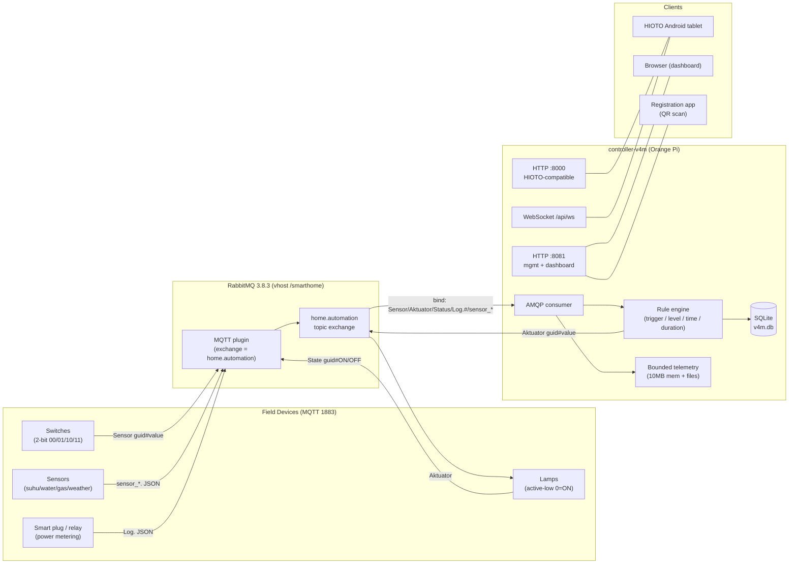
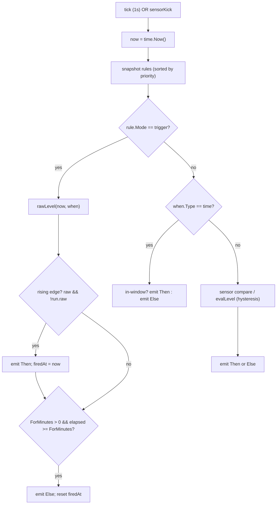
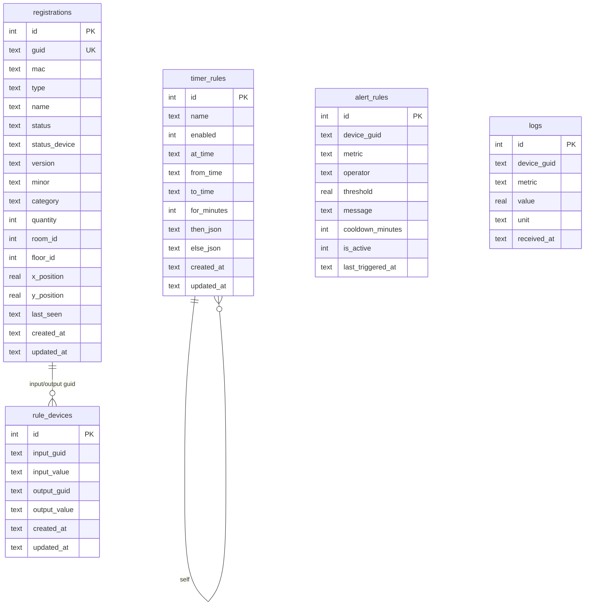

# Home Automation Controller — Technical Build Documentation

**Project:** HIOTO-compatible home-automation replacement on Orange Pi Zero (Armbian)
**Versions covered:** V1 → V5 (focus on **V4m** and **V4m2**)
**Date:** 2026
**Status:** Production-deployed at `192.168.1.22`

> This document is the authoritative engineering record for the V4m / V4m2
> controller. It includes the reverse-engineering analysis of the original
> HIOTO system, the full V4m2 implementation, wire protocols, database schema,
> APIs, diagrams (Mermaid), image placeholders, AI-generation prompts, and a
> future-work roadmap.

---

## Table of Contents

1. [Executive Summary](#1-executive-summary)
2. [Version History & Naming](#2-version-history--naming)
3. [System Architecture](#3-system-architecture)
4. [HIOTO Analysis (Reverse Engineering)](#4-hioto-analysis-reverse-engineering)
5. [V4m2 Implementation](#5-v4m2-implementation)
6. [Comparison: HIOTO vs V4m2 (Latest)](#6-comparison-hioto-vs-v4m2-latest)
7. [Wire Protocols & MQTT Topics](#7-wire-protocols--mqtt-topics)
8. [Rule Engine Internals](#8-rule-engine-internals)
9. [Database Schema](#9-database-schema)
10. [HTTP API Reference](#10-http-api-reference)
11. [Telemetry & Storage](#11-telemetry--storage)
12. [Deployment & Operations](#12-deployment--operations)
13. [Diagrams, Schematics & Image Placeholders](#13-diagrams-schematics--image-placeholders)
14. [AI Image-Generation Prompts](#14-ai-image-generation-prompts)
15. [Bugs Fixed & Lessons Learned](#15-bugs-fixed--lessons-learned)
16. [Future Work](#16-future-work)
17. [Appendix](#17-appendix)

---

## 1. Executive Summary

The project replaces a proprietary **HIOTO** smart-home edge worker (Go binary +
RabbitMQ + SQLite, with cloud sync) with a **local-only, plaintext** controller
codename **V4m**, then upgraded to **V4m2** to import the real HIOTO fleet
(135 devices, 278 switch→lamp rules) and be wire-compatible with the existing
**Android/tablet app**.

**V4m** = plaintext, local-only, no mTLS; a self-contained Go controller with
its own rule engine and SQLite telemetry.

**V4m2** = V4m + the full real HIOTO device set + a HIOTO-compatible REST/WebSocket
API (`:8000`) so the unmodified tablet app can list and control devices.

The controller now also provides an embedded **web dashboard** (floors/tabs,
inline editing, live telemetry history, device registration with QR scanning,
CSV import/export, and **timer rules**) and a **device-management API** on
`:8081`.

**Headline numbers (deployed):**

| Metric | Value |
|---|---|
| Devices | 135 (46 lamps, 37 wired switches, smart plugs/relays, sensors) |
| rule_devices rows | 278 |
| Compiled switch-state rules | 132 |
| Advanced (threshold) rules | 6 |
| Timer rules | 3 |
| Floors / Rooms | 4 / 12 |
| Binary size | ~15.4 MB (ARMv7) |
| RAM target | ≤ ~150 MB on a 512 MB Orange Pi |

---

## 2. Version History & Naming

| Version | Description |
|---|---|
| V1 | Initial MQTT/AMQP proof-of-concept |
| V2 | Single `home.automation` topic exchange, controller/monitor queues |
| V3 | V4-style structured topics `home/<kind>/<type>/<serial>/<class>` |
| V4 | Rule engine (level + trigger + hysteresis + debounce), SQLite registry |
| **V4m** | **Plaintext, local-only** fork of V4 (no mTLS), QR onboarding, embedded UI |
| **V4m2** | **Full real HIOTO device import** + HIOTO-compatible API for the tablet |
| V5 | *(future)* local users/security, TLS/mTLS, agent connectivity |

`V4m` and `V4m2` are the primary focus of this document.

---

## 3. System Architecture

### 3.1 Component diagram (Mermaid)



### 3.2 Image placeholder

```text

```
**Placeholder:** `assets/v4m2-architecture.png` — a high-resolution raster of the
above component diagram (see §14 for the AI prompt to generate it).

---

## 4. HIOTO Analysis (Reverse Engineering)

The original HIOTO system was reverse-engineered from the running worker binary
and its `AppData.db`. Key findings:

### 4.1 Profile

| Attribute | Value |
|---|---|
| Language / size | Go, **56 MB** statically linked |
| HTTP API | `:8000` — Fiber + **JWT (RS256)** + WebSocket |
| Broker | RabbitMQ local (5672/1883) **+ cloud** `hioto-rmq.pptik.id` **+** SmartParking `rmq2.pptik.id` |
| AMQP exchanges | `amq.direct`, `amq.topic` |
| Routing keys | `Control`, `Register_request/response`, `Update_device/response`, `Delete_device/response`, `Rules_response`, `Floor_sync`, `Monitoring` |
| Device registration | MQTT `Register_request.<MAC>` (unauthenticated) |
| Rule engine | `rule_devices` equality only |
| Database | `AppData.db` — **18 tables** |
| Cloud | `sync_states` cursors, Firebase FCM, Firestore + GCS (cameras) |
| Retention | 60-day auto-purge |

### 4.2 MQTT topics (observed live)

| Topic (MQTT) | AMQP routing key | Payload | Purpose |
|---|---|---|---|
| `Sensor` | `Sensor` | `guid#value` | Switch/DI state |
| `Aktuator` | `Aktuator` | `guid#value` | Actuator command/feedback |
| `Status` | `Status` | `guid#1` | Heartbeat |
| `State` | `State` | `guid#ON` / `guid#OFF` | Lamp physical-state feedback |
| `sensor_suhu/<guid>` | `sensor_suhu.<guid>` | JSON `{guid, deviceName, value:{temperature,humidity}, unit}` | Temperature/humidity |
| `sensor_water_tank/<guid>` | `sensor_water_tank.<guid>` | JSON `{guid, devicename, value, unit:"CM"}` | Water level |
| `sensor_gas_detector/<guid>` | `sensor_gas_detector.<guid>` | JSON | Gas concentration |
| `sensor_weather/<guid>` | `sensor_weather.<guid>` | JSON | Weather station |
| `smart_bell/<guid>` | `smart_bell.<guid>` | (event) | Doorbell press |
| `Log/<guid>` | `Log.<guid>` | JSON `{guid, mac, deviceName, status, condition, value:{voltage,current,power,energy,frequency,pf}, unit}` | Smart plug / relay power metering |

> **Important discovery:** the HIOTO wire format for actuator commands AND
> switch/sensor state is a **plain `guid#value` string**, *not* JSON. The
> Android app sends `PUT /api/device/control` with
> `{"type":"AKTUATOR","message":"<guid>#<value>"}`.

### 4.3 Device model

- **Categories:** `AKTUATOR`, `SENSOR`, `SENSOR_CAMERA`, `SENSOR_SUHU`,
  `SENSOR_GAS_DETECTOR`, `SENSOR_WATER_TANK`, `SENSOR_WEATHER`, `SENSOR_BELL`,
  `SENSOR_SMART_RELAY`, `SENSOR_SMART_PLUG`, `DI_DO`, `DI/DO`.
- **Registration fields (full HIOTO scheme):** `guid`, `mac`, `type`, `name`,
  `version`, `minor`, `quantity`, `room_id`, `floor_id`, `x_position`,
  `y_position`, `status`, `status_device`, `category`, `last_seen`, timestamps.
- **Lamps are ACTIVE-LOW:** `guid#0` = ON, `guid#1` = OFF.
- **2-bit switches:** values `00/01/10/11` are parsed as binary → `0/1/2/3`
  (each bit = one rocker; a 2-channel switch drives 2 lamps).

### 4.4 Database (18 tables, summary)

Per-category telemetry tables (`log_temperatures`, `log_water_tanks`,
`log_gas_detectors`, `log_master_relays`, `log_smart_plugs`, `log_aktuators`,
`log_dispensers`, `monitoring_histories`), `registrations`, `rule_devices`,
`alert_rules`, `camera_captures`, `sync_states`, `fcm_tokens`, `floors`,
`rooms`, and others.

---

## 5. V4m2 Implementation

### 5.1 Controller (`home-automation/v4m/controller`)

Single Go binary. Key files:

| File | Responsibility |
|---|---|
| `main.go` | config, AMQP dial (retry), consume loop, rule engine tick, publish closure |
| `device.go` | categories, `kindOf`, `valueTypeOf`, `numericType`, `floorLabel`, `Device` |
| `hioto.go` | HIOTO topic binds, `handleHioto`, `parseHiotoMessage`, `hiotoCommand` |
| `hioto_api.go` | `:8000` HIOTO-compatible REST + WebSocket |
| `http.go` | `:8081` device/rule/timer/CSV API |
| `web.go` | embedded dashboard, SSE `/events`, live state, `/api/telemetry` |
| `ws.go` | gorilla WebSocket `/api/ws` |
| `db.go` | SQLite schema + CRUD |
| `timer.go` | timer rules (at / window / duration) |
| `telemetry.go` | bounded in-memory + rollover-file telemetry |

### 5.2 Rule engine

Supports **four** rule shapes:

1. **Equality** (`rule_devices`): switch state → lamp(s). Multi-output rows are
   merged into one rule with many `Then` actions.
2. **Threshold/hysteresis** (`advancedRules`): e.g. water-pump, AC, air-purifier.
3. **Trigger** (`Mode:"trigger"`): fires `Then` once on the rising edge (used by
   switch→lamp rules and "at" timer rules).
4. **Time / duration** (`Type:"time"` / `Type:"now"` + `ForMinutes`): timer rules.

### 5.3 Key features built (this project)

| Feature | Detail |
|---|---|
| Inline editing | click device name → edit → `PUT /api/devices/:guid` → auto re-sort |
| Bounded telemetry | ≤10 MB in-memory + ≤5 × 10 MB rollover files, oldest deleted |
| Dashboard tabs | floors (Lantai 1–4 + Lainnya) × Sensors/Actuators subtabs |
| Registration | full HIOTO scheme + webcam QR scan (jsQR) + manual form |
| CSV | `GET /api/devices/export.csv`, `POST /api/devices/import.csv` |
| Switch→lamp | inversion bug removed, trigger mode, immediate `kickRules` |
| Timer rules | at / window / duration (`for_minutes`), persisted + API + UI |
| Graceful reconnect | AMQP dial retry loop (no crash-restart) |

---

## 6. Comparison: HIOTO vs V4m2 (Latest)

| Dimension | HIOTO (original) | V4m2 (latest) |
|---|---|---|
| **Role** | Edge worker + cloud sync | Local rule engine + mgmt + telemetry |
| **Binary** | 56 MB (gRPC/Firebase/GCS) | ~15.4 MB |
| **HTTP API** | `:8000` JWT (RS256) | `:8000` (HIOTO-compatible, no auth yet) + `:8081` (mgmt/dashboard) |
| **WebSocket** | `/wrapper` (auth) | `/api/ws` (open) |
| **Broker** | local + cloud + SmartParking | local only |
| **Exchange** | `amq.direct`, `amq.topic` | `home.automation` (topic) |
| **Registration** | MQTT `Register_request.<MAC>` (unauth) | HTTP `/api/register` + QR scan + CSV |
| **Rule engine** | `rule_devices` equality only | equality + threshold/hysteresis + **trigger** + **time/duration timer** |
| **2-bit switches** | implicit | parsed binary `00/01/10/11` → 0–3 |
| **Telemetry** | 18 tables, 60-day retention | bounded (10 MB mem + 50 MB files) |
| **Cloud / FCM** | ✅ | ❌ (local-only) |
| **Floors/rooms** | ✅ 4/12 + positions | ✅ 4/12 (imported) |
| **Camera pipeline** | ✅ 1.4 M captures | ❌ |
| **Alert rules** | ✅ | schema only (0 rows) |
| **Auth** | JWT | ❌ (→ V5 future work) |

---

## 7. Wire Protocols & MQTT Topics

### 7.1 MQTT ↔ AMQP mapping

The RabbitMQ **MQTT plugin** is configured with `mqtt.exchange = home.automation`.
An MQTT publish to topic `a/b/c` becomes an AMQP message with routing key
`a.b.c` on the `home.automation` exchange. The controller binds:

```
Sensor  Aktuator  Status  Log.#
sensor_suhu.#  sensor_water_tank.#  sensor_gas_detector.#
sensor_weather.#  smart_bell.#
```

### 7.2 Payload reference

| Kind | Format | Example |
|---|---|---|
| Actuator command (out) | `guid#value` (text/plain) | `5a119b76-…#0` (ON) |
| Switch state (in) | `guid#value` | `e4681593-…#2` |
| Lamp feedback (in) | `guid#ON` / `guid#OFF` | `0e280e04-…#ON` |
| Temperature/humidity | JSON `value:{temperature,humidity}` | see §4.2 |
| Smart plug/relay | JSON `value:{voltage,current,power,energy,frequency,pf}` | see §4.2 |
| Heartbeat | `guid#1` | — |

**Active-low convention:** for lamps/relays, command `0` = ON, `1` = OFF.

---

## 8. Rule Engine Internals

### 8.1 Evaluation loop (simplified)



### 8.2 Timer rule semantics

| Mode | Condition | Behavior |
|---|---|---|
| **at** | `Type:"time", At:"HH:MM"` | fire `Then` once daily (trigger) |
| **window** | `Type:"time", From, To` | `Then` in window, `Else` outside (level) |
| **duration (scheduled)** | `Type:"time", At, ForMinutes:N` | `Then` at HH:MM, `Else` after N min |
| **duration (now)** | `Type:"now", ForMinutes:N` | `Then` immediately, `Else` after N min |

### 8.3 Immediate response (`kickRules`)

A buffered channel `sensorKick` wakes the control loop the moment a sensor
message arrives, so switch→lamp reacts in milliseconds instead of waiting up to
1 s for the next tick.

---

## 9. Database Schema

SQLite via `modernc.org/sqlite` (WAL, `busy_timeout=5000`, `synchronous=NORMAL`,
`MaxOpenConns(1)`). Path: `/var/lib/homeautomation/v4m.db`.



---

## 10. HTTP API Reference

### 10.1 Management + dashboard (`:8081`)

| Method | Path | Purpose |
|---|---|---|
| GET | `/api/state` | live device snapshot (sensors + actuators, sorted) |
| GET | `/api/telemetry?guid=&metric=&limit=` | bounded telemetry history |
| GET | `/events` | SSE live stream |
| POST | `/api/register`, `/api/register-device` | register device (full HIOTO scheme) |
| GET | `/api/devices` | list devices |
| GET/PUT/DELETE | `/api/devices/:guid` | get / partial-update / revoke |
| GET | `/api/devices/:guid/qr.png` | registration QR (full payload) |
| GET | `/api/devices/export.csv` | CSV export |
| POST | `/api/devices/import.csv` | CSV bulk import |
| POST | `/api/import-devices` | JSON bulk import |
| GET | `/api/rules` | rule_devices + advanced rules |
| POST | `/api/rule` | create rule_devices row |
| DELETE | `/api/rules/:id` | delete rule_devices row |
| POST | `/api/import-rules` | replace rule_devices |
| POST | `/api/clean` | clear devices + rules |
| GET | `/api/floors`, `/api/rooms` | floor/room pickers |
| GET/POST | `/api/timer-rules` | list/create timer rules |
| DELETE | `/api/timer-rules/:id` | delete timer rule |
| POST | `/api/timer-rules/:id/toggle` | enable/disable |
| POST | `/api/override`, `/api/release`, `/api/sensor`, `/api/sensor-release` | control aliases |

### 10.2 HIOTO-compatible API (`:8000`, for tablet)

Envelope: `{"code", "status", "message", "data"}`.

| Method | Path | Purpose |
|---|---|---|
| GET | `/api` | health |
| GET | `/api/devices` | list devices (alphabetical) |
| POST | `/api/device` | register device |
| GET/PUT/DELETE | `/api/device/:guid` | get/update/delete |
| PUT | `/api/device/control` | **control** `{"type":"AKTUATOR","message":"<guid>#<value>"}` |
| POST | `/api/control`, `/api/control-device` | control aliases |
| GET | `/api/rules` | list rules |
| POST | `/api/rule` | create rule |
| GET | `/api/floors`, `/api/rooms` | floor/room |
| GET | `/api/ws` | WebSocket |

---

## 11. Telemetry & Storage

- **In-memory buffer:** ≤ 10 MB, viewable from the dashboard History tab.
- **Rollover files:** `telemetry-<seq>.jsonl`, ≤ 10 MB each, ≤ 5 files (50 MB),
  oldest deleted first.
- **Flush:** on 10 MB overflow, every 5 min, and on shutdown (SIGTERM).
- **Legacy SQLite `logs` table** is pruned to 20 000 rows at startup.

---

## 12. Deployment & Operations

### 12.1 Build (cross-compile from Windows)

```powershell
$env:GOOS='linux'; $env:GOARCH='arm'; $env:GOARM='7'
go build -o controller-v4m .
```

### 12.2 Deploy

```bash
systemctl stop controller-v4m
pscp controller-v4m root@192.168.1.22:/root/controller-v4m.new
chmod +x /root/controller-v4m.new && mv /root/controller-v4m.new /root/controller-v4m
systemctl start controller-v4m
```

### 12.3 systemd unit (`controller-v4m.service`)

```ini
[Unit]
After=rabbitmq-server.service
Wants=rabbitmq-server.service

[Service]
Type=simple
ExecStart=/root/controller-v4m -period-ms 1000 -db /var/lib/homeautomation/v4m.db \
  -http-port 8081 -broker-host 192.168.1.22 -vhost /smarthome \
  -user smarthome -password Ssm4rt2!
Restart=always
RestartSec=5
```

### 12.4 Power-outage recovery

RabbitMQ uses `Type=notify` (systemd waits for broker readiness); the controller
is ordered `After=` it and now uses a **graceful AMQP dial retry loop** (2 s),
so it connects cleanly without crash-restart. See §15 (fix #7).

### 12.5 DNS & device provisioning (scaling to a large / multi-subnet home)

The single-board deployment hardcodes `192.168.1.22` everywhere. For a larger
home — multiple floors/VLANs/subnets, a standby board, and a growing ESP32 fleet —
that IP pinning becomes brittle. This section records the **target architecture**
for pointing devices at the controller by **DNS name** instead of a fixed IP.

**Design goals**

1. Devices reach the controller by a **stable name**, not an IP, so the controller
   can move / fail over without re-flashing devices.
2. Name resolution must **cross VLANs/subnets** — mDNS `.local` does **not**
   (it is link-local multicast and also unsupported by fixed-firmware devices).
3. DNS must not be a single point of failure tied to the controller.

**Internal domain**

Use a *reserved* internal TLD, not a made-up one:

| Choice | Verdict |
|---|---|
| `.local` | ❌ reserved for mDNS; conflicts with Bonjour/Avahi |
| `.lan` / `.home` | ⚠️ common but not officially reserved |
| **`.home.arpa`** | ✅ RFC 8375, reserved for home networks |
| subdomain you own (`iot.example.com`) | ✅ best if you own a domain + run split-horizon DNS |

**DNS server (and the "secondary DNS" trap)**

Run a local resolver that is authoritative for the internal zone: **AdGuard Home**,
**Pi-hole**, **dnsmasq**, or the router's **Unbound** (pfSense/OPNsense/OpenWrt).

> **Critical:** a "secondary" DNS server is **not** a failover target. Clients use
> the primary almost exclusively and only fall back to the secondary on a network
> *timeout* — never on a valid-but-wrong answer (NXDOMAIN). So the box that knows
> `mqtt.home.arpa` **must be the primary** (or the router must forward to it).
> For real redundancy run **two** resolvers (e.g. primary board + standby board),
> both as DNS1/DNS2 — never "router-primary + Pi-hole-secondary".

**Addressing scheme** (one A record → controller IP `192.168.1.22`)

| FQDN | Service | Port |
|---|---|---|
| `mqtt.home.arpa` | MQTT (devices) | 8883 TLS / 1883 legacy |
| `amqp.home.arpa` | AMQP (datacenter agent) | 5671 TLS |
| `dash.home.arpa` | dashboard | 8081 |
| `api.home.arpa` | HIOTO-compatible API | 8000 |

Give the controller a **DHCP reservation** so the IP is stable, and point the DNS
A records at it. On failover, update the A records (or move the reservation).

**Network layout (multi-subnet)**

```
VLAN 10 main   ── laptop / phone / dashboard ──► dash.home.arpa
VLAN 20 IoT    ── ESP32 + HIOTO gateway      ──► mqtt.home.arpa:8883
VLAN 30 guest  ── (no controller access)
        └── inter-VLAN routing allows only the needed ports
```

- One **DNS resolver** reachable from all VLANs (or two, for redundancy).
- **DHCP on each VLAN** hands out the resolver IP + search domain `home.arpa`, so
  every device picks up resolution automatically.
- Firewall: allow IoT → controller **only** on `8883`/`1883` (and AMQP `5671` for
  the agent), nothing else.

**Device provisioning (split by capability)**

*New devices (ESP32 / ESP-IDF — anything you write):*

- Broker = `mqtt.home.arpa:8883`, **mTLS** (per-device cert via
  `tools/gen-device-cert.sh`), MQTT username = `/smarthome:<user>` (vhost:user).
- They re-resolve the FQDN on reconnect, so DNS re-pointing works.
- Provision each device with a **JSON payload** (QR-scannable, matching the
  dashboard's existing onboarding):

```json
{
  "guid": "ESP32-KITCHEN-01",
  "broker": "mqtt.home.arpa",
  "port": 8883,
  "tls": true,
  "username": "/smarthome:esp32-kitchen",
  "password": "…",
  "ca": "…ca.crt…",
  "cert": "…ESP32-KITCHEN-01.crt…",
  "key": "…ESP32-KITCHEN-01.key…",
  "publish": ["Sensor"],
  "subscribe": ["Aktuator"]
}
```

*Legacy fixed-firmware devices (HIOTO gateway):*

- These are **pinned to `192.168.1.22`** and cannot follow DNS. Keep a permanent
  **"anchor IP"** reservation for them, and migrate them to ESP32 firmware over
  time. New devices must never hardcode the IP.

**Failover & flexibility**

| Scenario | Action | Device impact |
|---|---|---|
| Move controller to a new subnet | update `mqtt.home.arpa` A record + firewall | new devices re-resolve; legacy follow the anchor IP only if it moves too |
| Failover to standby | point `mqtt.home.arpa` at standby, or move the DHCP reservation | new devices follow DNS; legacy follow only the anchor IP |
| Zero-touch failover (advanced) | **floating IP (VIP)** via keepalived shared by primary + standby | *all* devices (even legacy) follow the VIP — no DNS or re-flash needed |

The **standby board** is the natural home for the DNS resolver: it is already
always-on and independent of the primary controller, so a primary failure cannot
take DNS down with it.

**Recommendation (incremental)**

1. **Now:** reserve `192.168.1.22`; if the router supports local DNS, add the four
   `.home.arpa` names.
2. **Standby board:** provision identically; on failover it takes `192.168.1.22`
   (or the VIP). Legacy devices re-attach with zero changes.
3. **New ESP32 fleet:** firmware uses `mqtt.home.arpa` + mTLS from day one.
4. **Large home:** add a pfSense/OPNsense/OpenWrt router with Unbound + VLANs, and
   the scheme above becomes the backbone.

See `DEVICE-DEVELOPMENT-GUIDE.md` §4.2 (device-side TLS) and §5.3 (ESP32 client
example).

---

## 13. Diagrams, Schematics & Image Placeholders

The following raster images should be generated (AI prompts in §14) and dropped
into `assets/`. Mermaid source is provided inline where appropriate.

| # | Placeholder file | Description |
|---|---|---|
| 1 | `assets/v4m2-architecture.png` | Full system architecture (see §3.1 Mermaid) |
| 2 | `assets/message-flow.png` | Switch → MQTT → controller → rule → lamp sequence |
| 3 | `assets/rule-engine-flow.png` | Rule-engine evaluation decision flow |
| 4 | `assets/db-er.png` | Database ER diagram (see §9 Mermaid) |
| 5 | `assets/floor-plan.png` | 4-floor / 12-room device layout (x/y positions) |
| 6 | `assets/dashboard-ui.png` | Dashboard UI mockup (floors, History, Devices, Rules) |
| 7 | `assets/deployment-topology.png` | Orange Pi + network + devices topology |
| 8 | `assets/v5-security-arch.png` | Future V5 security architecture (see §16.1) |
| 9 | `assets/agent-connectivity.png` | Future agent connectivity (see §16.2) |

```text
assets/
  v4m2-architecture.png
  message-flow.png
  rule-engine-flow.png
  db-er.png
  floor-plan.png
  dashboard-ui.png
  deployment-topology.png
  v5-security-arch.png
  agent-connectivity.png
```

---

## 14. AI Image-Generation Prompts

Use these with Midjourney / DALL·E 3 / Stable Diffusion XL. Keep the style
consistent: **clean flat technical illustration, dark UI theme, 4:3 or 16:9**.

### 14.1 System architecture

```
Clean flat technical diagram of a home-automation system on an Orange Pi Zero.
Left: field devices (wall light switches, ceiling lamps, temperature sensor,
water tank sensor, smart plug) connecting via MQTT to a central RabbitMQ broker
box. Center: a Go controller box (labeled "controller-v4m") with modules: rule
engine, SQLite database, bounded telemetry, HTTP API. Right: an Android tablet
app and a web dashboard browser. Arrows labeled "Sensor guid#value",
"Aktuator guid#value", "sensor_suhu JSON", "Log JSON". Dark navy theme
(#0f1420, #1a2130), blue accents (#4f8cff), crisp vector style, no text overflow.
```

### 14.2 Message flow (switch → lamp)

```
Sequence diagram, flat vector style, dark theme. Steps: (1) user flips a
2-channel light switch, (2) switch publishes "e4681593#2" to MQTT topic Sensor,
(3) RabbitMQ routes to the controller, (4) controller rule engine fires a
trigger rule, (5) controller publishes "5a119b76#0" to Aktuator, (6) lamp turns
ON and publishes "State 5a119b76#ON". Numbered arrows, minimal labels, blue/green
accents, white text on dark background.
```

### 14.3 Floor plan

```
Top-down floor-plan schematic of a 4-floor building (Lantai 1-4). Each floor has
rooms (Living Room, Garage Area, Bath Room, Kitchen, Lab Automation, Storage,
Meeting Room, Teras, Ruangan Zalfa). Small icons for lamps and light switches
placed on walls. Dotted lines connect each switch to its lamps. Clean flat
architectural style, muted colors, labels in Indonesian room names.
```

### 14.4 Dashboard UI

```
High-fidelity web dashboard UI mockup, dark theme (#0f1420 background).
Top bar: "Home Automation V4m" with a green connected dot. Tabs: Lantai 1,
Lantai 2, Lantai 3, Lantai 4, Lainnya, History, Rules, Devices, Setup.
Main panel shows a list of device rows (name, type, ON/OFF badge, buttons ON/OFF).
Side shows a telemetry history chart. Clean modern SaaS dashboard, blue accents.
```

### 14.5 Deployment topology

```
Network topology diagram: a small router/switch at top, an Orange Pi Zero board
(labeled 192.168.1.22) connected via Ethernet, RabbitMQ and controller running on
the Pi, wireless MQTT devices (lamps, switches, sensors) connected over the LAN,
an Android tablet and a laptop browser on the same network. Flat vector, labeled
IP addresses and ports (1883, 5672, 8000, 8081).
```

### 14.6 V5 security architecture (future)

```
Security architecture diagram: users (admin/operator/viewer) authenticate via
JWT or session login to a Go controller. TLS (HTTPS) on ports 8081 and 8000,
mTLS on MQTT 1883. A role-based access control layer gates device control and
rule editing. An audit log records actions. Flat vector, dark theme, lock icons,
blue/green trust zones.
```

### 14.7 Agent connectivity (future)

```
Diagram of a "special agent" (a companion app or cloud bridge) connecting to the
controller. Agent scans a QR code to onboard, then authenticates, subscribes to
WebSocket /api/ws for live device state, sends control commands via REST
/api/device/control, and mirrors the tablet experience. Flat vector, two panes
(device/cloud agent on left, controller on right), numbered handshake steps.
```

---

## 15. Bugs Fixed & Lessons Learned

| # | Symptom | Root cause | Fix |
|---|---|---|---|
| 1 | Switch "doesn't work" | switch publishes plain `guid#value`, not JSON | added `parseHiotoMessage` |
| 2 | Lamp ON/OFF reversed | lamps active-low (`0`=ON) | fixed dashboard badge + buttons |
| 3 | Switch→lamp reversed | engine applied `1 - output_value` | removed inversion (forward verbatim) |
| 4 | Tablet command overridden by switch | rules re-asserted every tick | switch rules → `Mode:"trigger"` |
| 5 | ~1 s delay switch→lamp | rule loop ran only on 1 s tick | `kickRules` immediate wake |
| 6 | "everything on/off" loop | binding `State` topic echoed lamp feedback to tablet → tablet re-sent commands | reverted `State` binding |
| 7 | Crash-restart on RabbitMQ race | `log.Fatalf` on dial failure | graceful dial retry loop |
| 8 | Smart plug power data missing | metrics nested under `value` | parse nested `value` object |
| 9 | Sensor info missing | `State` topic not bound | *(reverted — see #6; power fix kept)* |

---

## 16. Future Work

### 16.1 (1) Local User & Security Management for V5

Currently V4m2 is **plaintext and unauthenticated** (by design). V5 should add
local identity and security without losing the tablet compatibility.

**Proposed scope:**

1. **Local users & roles** — new `users` table (`id, username, password_hash,
   role, created_at`). Roles: `admin` (full), `operator` (control + rules),
   `viewer` (read-only). Password hashing with **argon2id** or **bcrypt**.
2. **Authentication** — issue **JWT (HS256/RS256)** on login; protect `:8081`
   and `:8000` management/control endpoints. A `/api/login` + `/api/logout`.
3. **Authorization (RBAC)** — middleware maps role → allowed routes/actions;
   `viewer` cannot POST control/rule; `operator` cannot manage users.
4. **TLS** — HTTPS on `:8081` and `:8000` with a self-signed or CA-signed cert
   (V5 already has `gen-certs.sh`); optional Let's Encrypt later.
5. **MQTT security** — per-device RabbitMQ users + **topic permissions**, and
   optionally **mTLS** on 1883/8883 (reuse the V5 TLS design).
6. **Audit log** — `audit_logs` table recording who did what/when.
7. **Registration hardening** — QR payload carries a short-lived **onboarding
   token**; the registration endpoint requires it (prevents unauthenticated
   device injection).
8. **Secrets** — move `smarthome/Ssm4rt2!` out of the unit file into a
   permission-restricted env/file (systemd `EnvironmentFile` + `chmod 600`).

**Security diagram:** see §14.6 / `assets/v5-security-arch.png`.

### 16.2 (2) Seamless Connectivity via a "Special Agent" (tablet-like apps)

The goal: let a companion **agent** (a native mobile/desktop app, or a cloud
bridge) attach to the controller with the same ease as the HIOTO tablet.

**Proposed architecture:**

1. **Onboarding by QR** — the agent scans the registration QR (which already
   contains broker + credentials + full device payload). It stores the broker
   host, MQTT user/pass, and API base URL.
2. **Dual transport**:
   - **REST `:8000`** for commands and queries (`/api/device/control`,
     `/api/devices`, `/api/rules`, `/api/timer-rules`).
   - **WebSocket `/api/ws`** for live state push (already implemented; formalize
     the message contract: snapshot on connect + `device` update frames).
3. **MQTT client** — the agent can also subscribe directly to
   `Sensor/#`, `Aktuator/#`, `Status/#`, `sensor_*` topics for raw telemetry.
4. **Agent identity & auth** — an `agents` table + per-agent API key/JWT so each
   agent has scoped permissions (same RBAC as §16.1).
5. **A lightweight SDK / API client** — a typed client (Go/JS/Kotlin) that wraps
   REST + WS + MQTT, exposing `listDevices()`, `control(guid, value)`,
   `onState(callback)`, `createTimerRule(...)`, so building an agent is a few
   lines.
6. **Cloud-bridge mode** (optional) — an agent on the LAN can forward selected
   topics/state to a remote service over a single outbound WebSocket/TLS tunnel
   (no inbound ports), preserving the "local-only" principle while enabling
   remote monitoring.
7. **Registration agent** — a dedicated agent flow that uses the **webcam QR
   scanner** already built into the dashboard to register new devices.

**Agent connectivity diagram:** see §14.7 / `assets/agent-connectivity.png`.

---

## 17. Appendix

### 17.1 File inventory (key paths)

```text
home-automation/
  TECHNICAL-DOCUMENTATION.md          (this file)
  COMPARISON-v4m-vs-HIOTO.md
  V4m-REPORT.md
  data/hioto_export.json              (135 registrations, 278 rules, rooms, floors)
  v4m/
    controller/                       (Go controller; go:embed web)
      main.go  device.go  hioto.go  hioto_api.go
      http.go  web.go  ws.go  db.go  timer.go  telemetry.go
      web/dashboard/                  (index.html, app.js, style.css, jsQR.js)
      web/manager/
    manager/server.js                 (standalone Node mgmt UI :3006, dev-only)
    simulator/
  tools/                              (deployment + reverse-engineering scripts)
  v5.0/gen-certs.sh
```

### 17.2 Glossary

| Term | Meaning |
|---|---|
| HIOTO | Original proprietary smart-home system |
| V4m | Plaintext local-only controller |
| V4m2 | V4m + full HIOTO fleet + tablet API |
| Active-low | `0` = ON, `1` = OFF (lamps/relays) |
| 2-bit switch | switch publishing `00/01/10/11` → binary 0–3 |
| rule_devices | HIOTO switch→lamp equality mapping table |
| Trigger rule | fires once on condition rising edge |
| Timer rule | at / window / duration schedule |
| `kickRules` | immediate rule-evaluation wake on sensor message |

### 17.3 Prompt engineering notes

For regenerating diagrams consistently, prefix all prompts with:

```
Clean flat technical illustration, dark theme (#0f1420 background, #1a2130
panels, #4f8cff accents), white sans-serif labels, crisp vector lines, 16:9,
no watermark, no photographic textures.
```

---

*End of document.*
