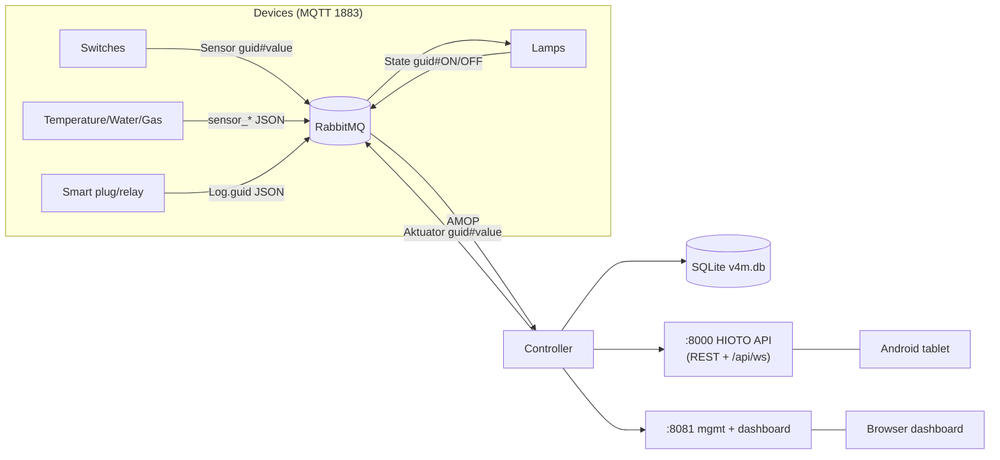

# Controller V4m/V4m2 — Technical As-Built & Developer Guide

This document describes the **controller** (the single Go binary `controller-v4m`)
as it is actually built and deployed. It is written for a developer who needs to
understand the code and extend it.

> For the broader system (HIOTO reverse-engineering, device fleet, wiring,
> future V5 security roadmap), see `../../TECHNICAL-DOCUMENTATION.md`.

---

## 1. What the controller is

A **local-only, plaintext** home-automation controller for an Orange Pi Zero
(Armbian). It:

1. Consumes device telemetry over **AMQP** (RabbitMQ) with the MQTT plugin.
2. Runs a **rule engine** (switch→lamp, threshold, timer) and publishes actuator
   commands.
3. Exposes a **HIOTO-compatible REST/WebSocket API** on `:8000` so the existing
   Android tablet app works unmodified.
4. Exposes a **management + dashboard API** on `:8081` (device CRUD, rules,
   timers, CSV, live telemetry, an embedded web UI).
5. Persists state in **SQLite** and keeps **bounded** telemetry (memory + files).

**One binary, no external runtime dependencies** — the web UI is embedded via
`//go:embed`.



---

## 2. Repository layout (this package)

```
controller/
├── main.go          # entrypoint: config, AMQP dial, consume loop, rule tick, publish
├── device.go        # device categories, kind/value-type mapping, floorLabel, Device struct
├── hioto.go         # HIOTO topic binds + message parsing + handleHioto
├── hioto_api.go     # :8000 HIOTO-compatible REST + WebSocket
├── http.go          # :8081 device/rule/CSV/floors API
├── timer.go         # timer rules (at / window / duration) + HTTP handlers
├── db.go            # SQLite schema + CRUD + write throttle
├── web.go           # embedded dashboard, live state, SSE, /api/telemetry
├── ws.go            # gorilla WebSocket /api/ws
├── telemetry.go     # bounded telemetry store (memory + rollover files)
├── web/             # embedded static UI (dashboard/ + manager/)
│   └── dashboard/   #   index.html, app.js, style.css, jsQR.js
├── go.mod / go.sum
└── controller-v4m.service   # systemd unit (deployment reference)
```

---

## 3. Build & run

### 3.1 Cross-compile (from a PC) to ARMv7

```powershell
cd home-automation/v4m/controller
$env:GOOS='linux'; $env:GOARCH='arm'; $env:GOARM='7'
go build -o controller-v4m .
```

Dependencies are vendored in `go.mod`/`go.sum` (`amqp091-go`, `modernc.org/sqlite`,
`gorilla/websocket`). If the module cache is cold, run once with
`$env:GOPROXY='https://proxy.golang.org,direct'`.

### 3.2 Run locally (dev)

```bash
./controller-v4m \
  -broker-host 192.168.1.22 \
  -vhost /smarthome -user smarthome -password 'Ssm4rt2!' \
  -db /var/lib/homeautomation/v4m.db \
  -http-port 8081
```

The dashboard is then at `http://<host>:8081/dashboard/`; the HIOTO API at `:8000`.

### 3.3 Configuration flags

| Flag | Default | Meaning |
|---|---|---|
| `-broker-host` | (env `BROKER_HOST`) | AMQP host (also embedded in QR) |
| `-port` | `5672` | AMQP port |
| `-vhost` | `/` | RabbitMQ vhost (must be `/smarthome`) |
| `-user` / `-password` | — | RabbitMQ credentials |
| `-exchange` | `home.automation` | topic exchange |
| `-period-ms` | `1000` | rule-engine tick (clamped ≥333 ms) |
| `-db` | `/var/lib/homeautomation/v4m.db` | SQLite path |
| `-http-port` | `8081` | management/dashboard API |
| `-broker-host` / `-mqtt-port` | — | public addresses encoded in QR |

---

## 4. Core concepts

### 4.1 Device model (`device.go`)

`Device` mirrors the full HIOTO registration scheme:

```go
type Device struct {
    GUID, MAC, Type, Name, Kind, ValueType, Status, StatusDevice,
    Version, Minor, Category string
    Quantity, RoomID, FloorID int
    XPosition, YPosition float64
    LastSeen, CreatedAt, UpdatedAt string
}
```

Derived fields:
- `kindOf(type)` → `"sensor"` / `"actuator"` / `"hybrid"`.
- `valueTypeOf(type)` → `"digital"` / `"analog"` / `"event"` / `"capture"`.
- `numericType(type)` → `1` (digital) / `2` (analog) — used in topic routing.
- `floorLabel(name)` → `"Lantai 1..4"` / `"Lainnya"` (parsed from HIOTO names).

**Categories** (`Categories`): `AKTUATOR`, `SENSOR`, `SENSOR_CAMERA`,
`SENSOR_SUHU`, `SENSOR_GAS_DETECTOR`, `SENSOR_WATER_TANK`, `SENSOR_WEATHER`,
`SENSOR_BELL`, `SENSOR_SMART_RELAY`, `SENSOR_SMART_PLUG`, `DI_DO`, `DI/DO`.

### 4.2 Two conventions every contributor must know

- **Lamps/relays are ACTIVE-LOW**: command `0` = **ON**, `1` = **OFF**.
- **2-bit switches**: a 2-channel switch publishes `00/01/10/11`, parsed as
  **binary → 0/1/2/3** (each bit = one rocker; a 2-channel switch drives 2 lamps).

### 4.3 Rule engine

The rule engine evaluates every tick (default 1 s) **and** immediately when a
sensor message arrives (`sensorKick` → `kickRules()`).

A `rule` is:

```go
type rule struct {
    Name     string
    Priority int
    Mode     string    // "" (level) or "trigger"
    When     condition
    Then, Else []action
}
type condition struct {
    Type     string  // "" (sensor), "time", "now"
    Sensor   string
    Op       string  // ==, !=, >, <, >=, <=
    Threshold float64
    Hysteresis float64
    MinDurationMs int
    At, From, To string      // HH:MM
    ForMinutes int           // duration timer
}
```

Four rule shapes:

| Shape | Source | Behavior |
|---|---|---|
| Equality (trigger) | `rule_devices` table | switch state → lamp(s); fires once on change |
| Threshold (level) | hardcoded `advancedRules()` | sensor compare + hysteresis + min-duration |
| Time (level) | timer rules | `Then` in window, `Else` outside |
| Time/now (trigger + duration) | timer rules | `Then`, then `Else` after `ForMinutes` |

Key helpers in `main.go`:
- `rawLevel(now, when, get)` — evaluates a condition (handles `time`/`now`).
- `evalLevel(when, v, run)` — hysteresis + min-duration for level rules.
- `rulesFromRuleDevices(rows)` — converts `rule_devices` rows into **trigger**
  rules, merging multi-output rows (one switch state → many lamps). Note: output
  values are forwarded **verbatim** (no inversion).

### 4.4 Telemetry (`telemetry.go`)

Bounded so it can't overwhelm a 512 MB Pi:

- **In-memory** ring: ≤ 10 MB, served by `GET /api/telemetry`.
- **Rollover files** `telemetry-<seq>.jsonl`: ≤ 10 MB each, ≤ 5 files (50 MB),
  oldest deleted first.
- Flush on 10 MB overflow, every 5 min, and on SIGTERM.

---

## 5. Database schema (`db.go`)

SQLite (WAL, `busy_timeout=5000`, `synchronous=NORMAL`, `MaxOpenConns(1)`).

| Table | Purpose | Key columns |
|---|---|---|
| `registrations` | device registry | `guid` (unique), `mac`, `type`, `name`, `status`, `status_device`, `version`, `minor`, `category`, `quantity`, `room_id`, `floor_id`, `x_position`, `y_position`, `last_seen`, timestamps |
| `rule_devices` | switch→lamp mappings | `input_guid`, `input_value`, `output_guid`, `output_value` |
| `timer_rules` | time-based rules | `name`, `enabled`, `at_time`, `from_time`, `to_time`, `for_minutes`, `then_json`, `else_json` |
| `alert_rules` | (reserved) threshold alerts | `device_guid`, `metric`, `operator`, `threshold`, `message`, `cooldown_minutes` |
| `logs` | legacy telemetry (pruned) | `device_guid`, `metric`, `value`, `unit`, `received_at` |

**Write throttle:** `throttled(key)` allows at most one write per `(guid,metric)`
per 5 s (protects the SD-card-backed SQLite writer).

---

## 6. API surface

### 6.1 `:8081` — management + dashboard

| Method | Path | Purpose |
|---|---|---|
| GET | `/api/state` | live snapshot (sensors + actuators, sorted) |
| GET | `/api/telemetry?guid=&metric=&limit=` | bounded history |
| GET | `/events` | SSE live stream |
| POST | `/api/register`, `/api/register-device` | register device (full HIOTO scheme) |
| GET/PUT/DELETE | `/api/devices/:guid` | get / partial-update / revoke |
| GET | `/api/devices/:guid/qr.png` | registration QR |
| GET | `/api/devices/export.csv` | CSV export |
| POST | `/api/devices/import.csv` | CSV bulk import |
| POST | `/api/import-devices` | JSON bulk import |
| GET/POST | `/api/rules`, `/api/rule`, `/api/rules/:id`, `/api/import-rules` | rule_devices CRUD |
| GET | `/api/floors`, `/api/rooms` | floor/room pickers |
| GET/POST | `/api/timer-rules` | list/create timer rule |
| PUT/DELETE | `/api/timer-rules/:id` | update/delete timer rule |
| POST | `/api/timer-rules/:id/toggle` | enable/disable |
| POST | `/api/override`, `/api/release`, `/api/sensor`, `/api/sensor-release` | manual control |

### 6.2 `:8000` — HIOTO-compatible (for the tablet)

Envelope `{code, status, message, data}`. Control =
`PUT /api/device/control` with `{"type":"AKTUATOR","message":"<guid>#<value>"}`.
Also: `GET /api/devices`, `POST /api/device`, `GET/PUT/DELETE /api/device/:guid`,
`GET /api/rules`, `POST /api/rule`, `GET /api/floors`, `GET /api/rooms`,
`GET /api/ws`.

---

## 7. Wire protocol (MQTT ↔ AMQP)

The RabbitMQ **MQTT plugin** maps MQTT topic `a/b/c` → AMQP routing key `a.b.c`
on exchange `home.automation` (`mqtt.exchange = home.automation`). The controller
binds:

```
Sensor  Aktuator  Status  Log.#
sensor_suhu.#  sensor_water_tank.#  sensor_gas_detector.#
sensor_weather.#  smart_bell.#
```

| Direction | Topic | Payload |
|---|---|---|
| In | `Sensor` | `guid#value` (switch state) |
| In | `Status` | `guid#1` (heartbeat) |
| In | `sensor_suhu.<guid>` | JSON `{guid, deviceName, value:{temperature,humidity}, unit}` |
| In | `sensor_water_tank.<guid>` | JSON `{guid, devicename, value, unit}` |
| In | `Log.<guid>` | JSON `{guid, mac, deviceName, status, condition, value:{voltage,current,power,energy,frequency,pf}, unit}` |
| Out | `Aktuator` | `guid#value` (actuator command; `0`=ON, `1`=OFF) |

> `parseHiotoMessage` accepts **either** JSON `{"guid","value"}` **or** plain
> `guid#value`. `handleHioto` extracts metrics from both the top level and a
> nested `value` object (for smart plug/relay power).

---

## 8. Extension guide

This is the "how to add a feature" section. Each entry points to the exact spot
and pattern to follow.

### 8.1 Add a new device category

1. Add the string to `Categories` in `device.go`.
2. If it has a special role/value type, extend `kindOf` / `valueTypeOf` /
   `numericType`.
3. If it publishes on a new MQTT topic, add the binding to `hiotoTopicBinds`
   **and** the prefix match in `isHiotoRoutingKey` (in `hioto.go`).
4. If it has specific metrics, add the metric name to the `metrics` slice in
   `handleHioto`.

### 8.2 Add a new rule-engine mode

The evaluation loop is the `for { select { <-ticker.C / <-sensorKick } ... }`
block in `main.go`. A rule's behavior is chosen by `Mode` + `When.Type`:

- To add a **trigger** variant, follow the `if r.Mode == "trigger"` block.
- To add a **time** variant, follow the `if r.When.Type == "time"` block and
  extend `rawLevel` in `main.go`.
- New condition fields go in `condition`; per-rule mutable state goes in
  `ruleRun`.

### 8.3 Add a new API endpoint (`:8081`)

Follow `registerTimerHandlers` (`timer.go`) as the template:

1. Add DB functions in `db.go` (or a new file).
2. Create a `registerXxxHandlers(mux, db, st)` function with a local `send`
   helper (or reuse `json.NewEncoder`).
3. Call it from `startHTTP` in `http.go` (near `registerTimerHandlers`).
4. If the change affects the engine, call `loadTimerRules(db, st)` / a reload
   function after writes (mutate `st.rules`/`st.runs` under `st.mu`).

### 8.4 Add a new timer-rule semantics

1. Add a field to `TimerRule` and the `timer_rules` table (migration in `db.go`).
2. Extend `toRule()` in `timer.go` to map the field to a `condition`.
3. If it needs engine support (like `ForMinutes` did), add it to `condition`
   and the trigger/time handling in `main.go`.

### 8.5 Add a new dashboard feature

The dashboard is `web/dashboard/` (embedded via `go:embed web` in `web.go`).
`app.js` is plain ES6 with helpers `$`, `post`, `esc`, `renderFloors`,
`loadTimerRules`, etc. Add markup in `index.html`, styles in `style.css`, and
logic in `app.js`. Rebuild the binary to re-embed (no separate web build step).

### 8.6 Add a new telemetry metric

In `handleHioto` (`hioto.go`), either:

- Add the metric name to the `metrics` slice (top-level + nested `value`), or
- Call `recordTelemetry(guid, name, metric, value)` explicitly.

`recordTelemetry` is throttled per `(guid,metric)` and appends to the bounded
store in `telemetry.go`.

### 8.7 Concurrency rules

- `state` (`st`) is guarded by `st.mu` — take `RLock` to read rules/sensors,
  `Lock` to mutate.
- `liveState`/`liveClients` are guarded by `liveMu` / `liveClientMu` (`web.go`).
- `wsClients` by `wsMu` (`ws.go`).
- `tel` (telemetry store) has its own mutex (`telemetry.go`).
- SQLite is `MaxOpenConns(1)` — all DB access is serialized by the driver.

---

## 9. Testing & debugging

- **Dashboard**: open `http://<host>:8081/dashboard/`, watch the SSE dot and the
  History tab.
- **Live log**: `journalctl -u controller-v4m -f`. Incoming switch state logs as
  `[hioto] Sensor <guid> = <value>`.
- **Telemetry probe**: `curl 'http://127.0.0.1:8081/api/telemetry?limit=100'`.
- **Rules**: `curl http://127.0.0.1:8081/api/rules`.
- **Timer rules**: `curl http://127.0.0.1:8081/api/timer-rules`.
- **RabbitMQ traffic**: management UI `http://<host>:15672` (user `admin`), or
  bind a temporary `#` queue to observe routing keys.
- **Known gotcha**: a rule that re-asserts every tick will fight manual/tablet
  commands — switch rules must stay `Mode:"trigger"`; time rules should be
  trigger (at/duration) or level (window) **only** when a continuous window is
  intended.

---

## 10. Deployment & operations

Systemd unit: `controller-v4m.service`

```ini
[Unit]
After=rabbitmq-server.service
Wants=rabbitmq-server.service
[Service]
Type=simple
ExecStart=/root/controller-v4m -period-ms 1000 -db /var/lib/homeautomation/v4m.db \
  -http-port 8081 -broker-host 192.168.1.22 -vhost /smarthome \
  -user smarthome -password 'Ssm4rt2!'
Restart=always
RestartSec=5
```

Deploy cycle: `systemctl stop controller-v4m` → copy binary → `chmod +x` →
`mv` → `systemctl start`.

**Startup/recovery:** the AMQP dial uses a **retry loop** (2 s) instead of
crash-restart; RabbitMQ is `Type=notify` so systemd waits until the broker is
ready. The controller re-loads devices/rules/timers from SQLite on start.

---

## 11. MQTT TLS terminator (stunnel)

RabbitMQ 3.8.3's own MQTT-TLS listener crashes on client connect
(`rabbit_mqtt_processor {error,einval}`), so device TLS is terminated by a
**stunnel** wrapper that fronts the broker's plaintext `1883`:

```
ESP32 (MQTT TLS :8883) ──► stunnel ──► 127.0.0.1:1883 ──► RabbitMQ ──► controller
Legacy devices (:1883) ─────────────────────────────────► RabbitMQ ──► controller
```

- Config: `/etc/stunnel/mqtt-tls.conf` (repo copy: `tools/stunnel-mqtt-tls.conf`).
- Certs: `/etc/stunnel/certs/{server.crt,server.key,ca.crt}` — copies of the
  RabbitMQ server cert/key + CA, owned by the `stunnel4` user.
- `verify = 2` → mTLS (require a device client cert); `verify = 0` → server-only.
- Per-device client certs: `tools/gen-device-cert.sh <name>` (deployed at
  `/usr/local/bin/gen-device-cert.sh`), signed by `HomeAutomation-CA`.
- Enable/start: `systemctl enable --now stunnel4`.

**MQTT username quirk:** RabbitMQ 3.8.3 parses the MQTT username as
**`vhost:user`** (vhost *first*). To reach `/smarthome` as `smarthome`, use the
username `/smarthome:smarthome`.

Verified end-to-end (publish via 8883 → receive on 1883):

```bash
mosquitto_sub -h 127.0.0.1 -p 1883 -u '/smarthome:smarthome' -P 'Ssm4rt2!' -t test/tls -C 1 &
mosquitto_pub -h 127.0.0.1 -p 8883 --cafile ca.crt --cert ESP32-DEMO-01.crt --key ESP32-DEMO-01.key \
  -u '/smarthome:smarthome' -P 'Ssm4rt2!' -t test/tls -m hello
```

See `../../DEVICE-DEVELOPMENT-GUIDE.md` §4.2 for the device-side TLS setup.

---

## 12. Contribution guidelines

1. Keep the controller **plaintext/local-only** by default (V5 security is a
   separate, opt-in layer — see `../../TECHNICAL-DOCUMENTATION.md` §16).
2. Preserve **HIOTO wire compatibility** (plain `guid#value`, active-low lamps,
   2-bit switches, `:8000` API envelope) — the tablet app depends on it.
3. Prefer **trigger rules over level rules** for anything switch/event-driven to
   avoid fighting manual control.
4. Bound any new storage (follow the telemetry pattern: memory cap + rollover
   files, never unbounded growth).
5. Add DB migrations idempotently (the `migrate()` function runs `CREATE TABLE
   IF NOT EXISTS` + `ALTER TABLE ADD COLUMN` guarded against duplicates).
6. Document new endpoints and wire formats in this README and in
   `../../TECHNICAL-DOCUMENTATION.md`.

---

*As-built: V4m2 controller, 135 devices, 278 rule_devices (132 switch-state
rules), 6 advanced rules, timer rules (at/window/duration), bounded telemetry,
HIOTO-compatible `:8000` API, embedded dashboard, MQTT TLS terminator (stunnel).*
